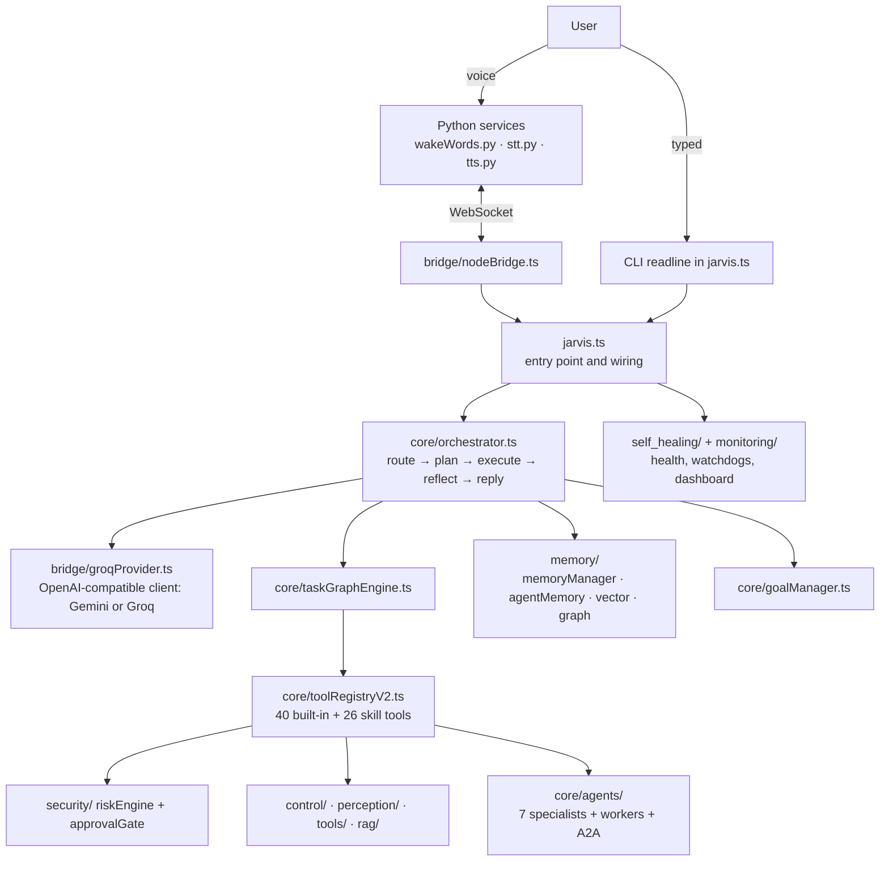
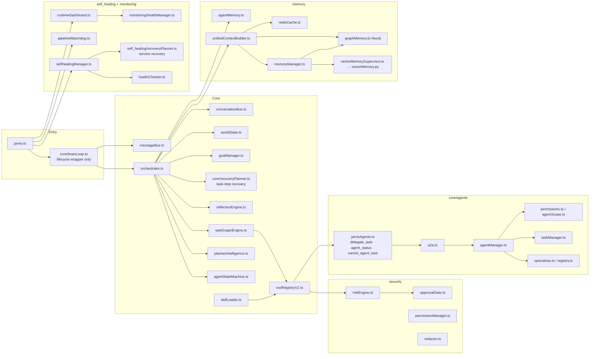
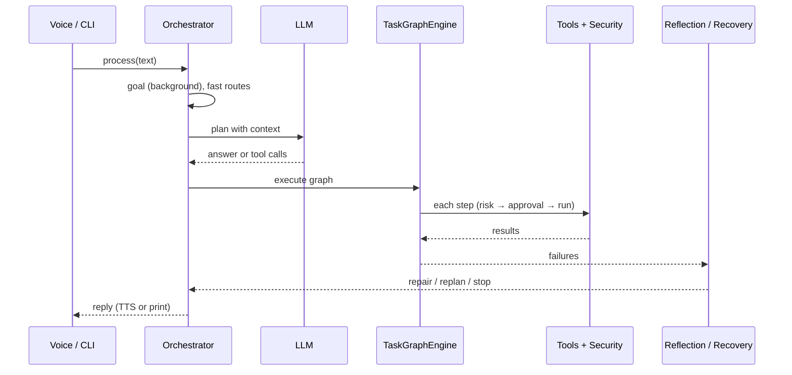
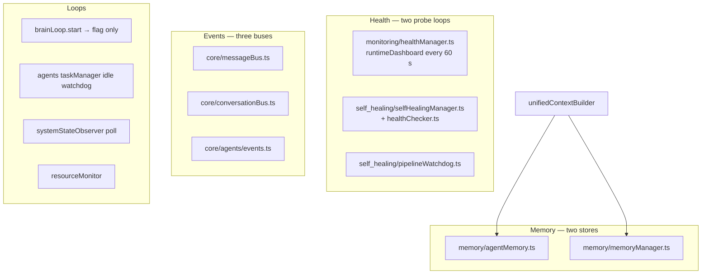

# JARVIS — Current Architecture Report

Inspection only. No code was changed to produce this report. This file is the only file added.

Branch inspected: `claude/jarvis-repair` (head `fbb248f`). Evidence comes from reading the source and the tests in `tests/`.

**Status labels used throughout**

| Label | Meaning |
|---|---|
| **Implemented** | Code is wired into the running path and covered by an offline test that passes in CI (last CI: 115 passed, 0 failed, 8 skipped). |
| **Partial** | Code exists and runs, but part of the feature is missing, never called, or not connected. |
| **Planned** | Stub, placeholder, or code that is disabled or never called. |
| **Unverified** | Code is wired, but it depends on something the tests do not exercise: live Gemini/Groq, real Windows, the real embedding model, Neo4j, Redis, real Chrome. |

---

## 1. Architecture diagrams

### 1a. High level

### 1b. Components

---

## 2. Core components

| Component | File | Responsibility | Status | Depends on |
|---|---|---|---|---|
| Entry point | `jarvis.ts` | Startup order, Python services, voice handlers, CLI, shutdown | Implemented | everything below |
| BrainLoop | `core/brainLoop.ts` | Calls `orchestrator.startLoop()`; forwards state changes to `messageBus` | Partial — "autonomy loop" is a flag only (see §7) | orchestrator, agentStateMachine, messageBus |
| Orchestrator | `core/orchestrator.ts` (2726 lines) | Routes each request, plans, executes, reflects, repairs, replies | Implemented; live LLM path Unverified | everything in Core |
| State machine | `core/agentStateMachine.ts` | IDLE/PLANNING/EXECUTING/REFLECTING/REPAIRING/SPEAKING/INTERRUPTED; speaking watchdog | Implemented (`ttsLifecycleStateTest`, `ttsRetryWatchdogTest`) | — |
| Task graph | `core/taskGraphEngine.ts` | Runs the plan as a dependency graph; replan limits; interrupt | Implemented | toolRegistryV2 |
| Planner checks | `core/plannerIntelligence.ts` | Graph analysis, alternatives for failed steps | Implemented (used by orchestrator only) | — |
| Reflection | `core/reflectionEngine.ts` | Pre-, mid- and post-execution checks; repair strategy | Implemented | LLM for unknown failures |
| Step recovery | `core/recoveryPlanner.ts` | Diagnoses failed steps, up to `MAX_RECOVERY_ROUNDS` | Implemented (`errorRecoveryTest`) | core/diagnosis.ts |
| Tool registry | `core/toolRegistryV2.ts`, `core/tools/index.ts` | 40 built-in tools; risk metadata | Implemented (`startupRegistrationTest`) | security |
| Skills | `core/skillLoader.ts`, `skills/*` | 26 skill tools added after the built-ins (total 66) | Implemented | toolRegistryV2 |
| Goals | `core/goalManager.ts` | Goal records in lowdb; status, retries, priority | Partial (see §3) | lowdb |
| World state | `core/worldState.ts` | Current task, steps, observations for the planner | Implemented (`worldStateTest`) | perception |
| LLM client | `bridge/groqProvider.ts` | One OpenAI-compatible client for Gemini or Groq | Implemented offline; live calls Unverified | API key |
| Voice bridge | `bridge/nodeBridge.ts` + `voice/*.py` | Wake word, STT, TTS over WebSocket | Implemented offline; real mic/speaker Unverified | Python |
| Agents | `core/agents/*` | Specialists, workers, A2A | Implemented (see §4) | toolRegistryV2, LLM |
| Memory | `memory/*` | Short-term, long-term, vector, graph | Partial (see §6) | Python, Neo4j, Redis |
| Security | `security/*` | Risk levels, approvals, redaction, audit | Implemented (see §8) | — |
| PC control | `control/*`, `perception/*` | Windows/browser observe and act | Implemented offline; real Windows Unverified (`pnpm verify:windows` exists) | PowerShell, CDP |
| Health | `self_healing/*`, `monitoring/*` | Service restarts, watchdogs, dashboard | Implemented, with overlap (see §11) | — |
| RAG | `rag/*` | Ingest and search local documents | Implemented (`ragPipelineTest`) | vector service |
| Backup | `system/backupRestore.ts` | Snapshot data files | Partial — scheduler never started (see §7) | — |

---

## 3. Goal system

| Question | Answer | Evidence | Status |
|---|---|---|---|
| How are goals created? | `orchestrator.process()` calls `goalManager.createGoal(input, source)` for every request that is not a deterministic command or simple chat. | `core/orchestrator.ts:271-290` | Implemented (`simpleNoGoalTest`, `goalLifecycleAuditTest`) |
| How are they executed? | Not by the goal system. The request text runs through `runAgentLoop()`; the goal is a record that follows it (`planning` → `executing`). | `core/orchestrator.ts:501-515` | Implemented as a record only |
| How are they completed? | `process()` calls `completeGoal` or `failGoal` after the loop. | `core/orchestrator.ts:313-356` | Implemented |
| How are they repeated? | `failGoal` sets status `retry` until `maxRetries` (3). **Nothing reads the `retry` status back and runs it again.** `getPriorityQueue()`, `resumeGoal()`, `mergeGoals()`, `updatePriority()` have no callers outside tests. | `core/goalManager.ts:286-340, 463`; grep shows no callers | Partial — retry is recorded, never re-run |
| How are they stored? | lowdb JSON file under the data root, written through the redactor. | `core/goalManager.ts:121-162` | Implemented |
| Startup | `init()` runs once (guarded). Goals left `in_progress/planning/executing/waiting` are reset to `pending`. | `core/goalManager.ts:111-162`; `goalManagerInitTest` | Implemented |
| Shutdown | Active goals are saved as `paused`. | `jarvis.ts:890` | Implemented |
| Recurring or permanent goals | None. No schedule field, no recurrence. | `core/goalManager.ts` type `Goal` | Missing |

---

## 4. Agent system

| Feature | What exists | Evidence | Status |
|---|---|---|---|
| Subagents | Seven specialists: research, coding, browser, pc, memory, data, qa. Each runs its own LLM loop with a restricted tool set. | `core/agents/specialists.ts`, `registry.ts`; `sevenAgentTest`, `agentSpecialistsTest` | Implemented offline (scripted model); live Unverified |
| Nested subagents | Specialists can spawn workers; depth ≤ 4, children ≤ 5, active ≤ 20, budgets, cycle checks on dependencies. | `core/agents/spawnPolicy.ts`, `agentManager.ts`; `agentRuntimeTest` | Implemented |
| A2A | A2A v1.0 JSON-RPC: in-process client/server always; HTTP server only when `JARVIS_A2A_PORT` and a token of 16+ characters are set. | `core/agents/a2a.ts`, `jarvisAgents.ts:95-120`; `a2aProtocolTest` | In-process Implemented; HTTP opt-in, Unverified on a real LAN |
| Messages between agents | Only parent ↔ child and between siblings. | `core/agents/agentManager.ts`; `agentRuntimeTest` | Implemented |
| Parallel execution | Independent child tasks run together (`Promise.all` / `allSettled`) under a semaphore. | `agentManager.ts:422, 1190`, `semaphore.ts` | Implemented |
| Result aggregation | Parent collects child results; a QA verification pass checks them. | `agentManager.ts`, `specialists.ts`; `sevenAgentTest` | Implemented |
| How JARVIS reaches agents | Fixed routes in `matchAgentRoute` (status, stop, "ask the X agent to…", "delegate:", "in the background,", research requests). Otherwise the planner sees `delegate_task` only for research/compare wording. | `core/orchestrator.ts`; `jarvisAgentIntegrationTest` | Implemented; routing is narrow |
| Missing | Agents never pick up stored goals; no agent runs on a schedule; agent tasks are not persisted across restarts (in memory only). | — | Missing |

---

## 5. Execution flow

Simple explanation:

1. Input arrives from voice (`stt_result`) or the CLI. A pending approval question takes the answer first.
2. `orchestrator.process()` starts a trace, handles barge-in, cancels any earlier request, and creates a goal in the background.
3. `runAgentLoop()` tries the fast routes first: deterministic commands (open app, status, continue), then agent routes.
4. Otherwise `planPhase()` builds context (`unifiedContextBuilder`, recent goals, working memory, last 5 messages) and asks the LLM. The LLM either answers directly or returns tool calls.
5. Tool calls become a task graph. `reflectionEngine.preExecutionCheck` and `plannerIntelligence.analyzeGraph` check it.
6. `taskGraphEngine.execute` runs the steps. Each tool call goes through the risk engine and, if needed, the approval gate. `midExecutionCheck` can stop the run.
7. Failed steps: `recoverPhase` (step recovery) then `reflectionEngine.reflect` (repair strategy, alternatives, replan within limits).
8. A reply is written from the results, spoken through TTS or printed, and stored in `agentMemory`. The goal is completed or failed.
9. The state machine returns to IDLE.

| Part | File | Status |
|---|---|---|
| BrainLoop | `core/brainLoop.ts` (65 lines) | Thin wrapper. The old timer loop was removed. Execution is event-driven: nothing runs without input. |
| State machine | `core/agentStateMachine.ts` | Implemented |
| Reflection | `core/reflectionEngine.ts` | Implemented. The separate Python `voice/reflectionEngine.py` does not exist and its 30-minute schedule is commented out (`jarvis.ts:749-770`). |
| Recovery | `core/recoveryPlanner.ts` + `reflectionEngine` | Implemented; two recovery layers run one after the other. |

---

## 6. Memory

| Type | Where | What it does | Status |
|---|---|---|---|
| Working / short-term | `memory/agentMemory.ts` | Last messages, working context, episodes, tool results for the current request | Implemented |
| Short + long-term facts | `memory/memoryManager.ts` (lowdb) | Facts with importance; decay; search (vector + lexical) | Implemented. Decay runs once at startup, not on a schedule (`orchestrator.ts:164`). |
| Vector | `memory/vectorMemorySupervisor.ts` → `memory/vectorMemory.py` (FastAPI + sentence-transformers) | Semantic search; loading/failed states; circuit breaker | Implemented offline (`vectorReadinessTest`, `vectorStartupGateTest`); real model Unverified |
| Graph | `memory/graphMemory.ts` (Neo4j) | Entities and relations | Off by default (`JARVIS_NEO4J_ENABLED=true` + password needed). Unverified. |
| Cache | `memory/redisCache.ts` | Recent messages cache | Optional; falls back when Redis is absent. Unverified. |
| Context | `memory/unifiedContextBuilder.ts` | Joins the sources above for the planner | Implemented |
| Documents | `rag/*` | Ingest, chunk, index, retrieve | Implemented (`ragPipelineTest`) |
| Stub | `memory/memoryIndexer.py` | Placeholder class that only prints | Planned |

Two memory stores (`agentMemory` and `memoryManager`) hold conversation and facts separately; `unifiedContextBuilder` reads both.

---

## 7. Autonomy and scheduling

| Question | Answer | Status |
|---|---|---|
| Does JARVIS keep working without input? | No. `orchestrator.startLoop()` only sets `isLoopRunning = true`; nothing reads it. | Missing (the startup log line "Autonomy loop active" overstates it) |
| Permanent or recurring goals | Not supported. | Missing |
| Scheduler | No job scheduler (no cron library). Timers exist only for health checks, watchdogs, dashboard, resource monitor, agent idle check. `backupRestore.startScheduled()` exists but is never called. Python reflection schedule is disabled. | Missing / Planned |
| Resume after restart | Goals are reset to `pending` or saved as `paused`, but nothing runs pending, retry or paused goals after a restart. Agent tasks are in memory and are lost. | Partial — state is kept, work is not resumed |

---

## 8. Security

| Feature | How it works | Evidence | Status |
|---|---|---|---|
| Risk levels | `riskEngine` levels 0–4 per tool call | `security/riskEngine.ts`; `riskEngineTest` | Implemented |
| Approvals | Level 2 asks unless full-control mode is on (or policy says ask); level ≥ 3 always asks; level 4 needs a typed code. Voice and typed answers; type-ahead protection. | `security/approvalGate.ts`, `approvalRequest.ts`; `approvalGateStructuredTest`, `voiceApprovalTest`, `approvalTypeAheadTest` | Implemented |
| Tool restrictions | Command validator, file-system and workspace path policy, browser policy | `security/commandValidator.ts`, `fsPolicy.ts`, `workspacePathPolicy.ts`, `browserPolicy.ts`; `securityBypassTest`, `openAppSecurityTest` | Implemented |
| Subagent permissions | A child's tool scope is the intersection with its parent's; approvals carry the scope through AsyncLocalStorage | `core/agents/permissions.ts`, `agentScope.ts`, `security/approvalScope.ts`; `agentRuntimeTest` | Implemented |
| Secrets | Redaction on log, memory and goal writes | `security/redactor.ts` | Implemented |
| Audit | Security audit log, action audit log | `security/securityAuditLogger.ts`, `control/actionAuditLog.ts` | Implemented |
| A2A over HTTP | Off unless port + token set | `core/agents/jarvisAgents.ts:109-120` | Implemented |

---

## 9. Business capabilities (implemented and tested offline)

Only items with code on the live path and a passing test. Live LLM quality and real Windows behaviour are not covered by these tests.

- Answer questions and chat (LLM direct answer).
- Plan and run multi-step tool tasks with approval for risky steps.
- Open, find, focus and close apps and windows on Windows (`pnpm verify:windows` exists for the real check).
- Observe and control Chrome through CDP: tabs, page text, click, type, scroll, screenshot, download, upload.
- Read, write and search files inside the workspace; run git and dev commands; run tests and builds.
- Web search and weather skills.
- Ingest local documents and search them (RAG).
- Remember facts and recent conversation.
- Hand work to seven specialist agents that can run in parallel and check each other's results.
- Voice: wake word, speech-to-text, spoken replies, barge-in, spoken approvals.
- Self-healing of the Python services and a runtime dashboard.

---

## 10. Missing, incomplete, disconnected, duplicated, unreliable

**Confirmed problems**

1. **No autonomy loop.** `startLoop()` sets a flag nothing reads (`core/orchestrator.ts:421-430`). The log says "Autonomy loop active".
2. **Goals are never re-run.** `retry`, `pending` and `paused` goals stay where they are; `getPriorityQueue()` and `resumeGoal()` have no callers outside tests (`core/goalManager.ts`).
3. **No scheduler.** No recurring goals; `backupRestore.startScheduled()` is never called; the Python reflection job is commented out and its script `voice/reflectionEngine.py` does not exist (`jarvis.ts:749-770`).
4. **Agent tasks are lost on restart** (kept in memory only in `core/agents/taskManager.ts`).
5. **Narrow agent routing.** The planner is offered `delegate_task` only for research/compare wording; other tasks reach agents only through fixed phrases.
6. **Two health systems run side by side:** `monitoring/healthManager.ts` (dashboard) and `self_healing/healthChecker.ts` (via `selfHealingManager`). Both probe services.
7. **Two event buses plus agent events:** `core/messageBus.ts` (legacy subscribers via BrainLoop), `core/conversationBus.ts` (speaking/idle), `core/agents/events.ts`.
8. **Two memory stores** (`agentMemory`, `memoryManager`) with overlapping conversation data.
9. **Memory decay runs once at startup**, not periodically.
10. **Stubs:** `memory/memoryIndexer.py`, `agents/researchAgent.py` (1 line), `voice/wakeWord.py` (1 line; `wakeWords.py` is the real one), `learning/*.py`.
11. **Legacy folders still present:** `_legacy/`, `ai_workflows/`.
12. **Unverified in tests:** live Gemini/Groq, real Windows desktop, the real embedding model, Neo4j, Redis, A2A over a real network.

**Checked and not duplicates** (different jobs, layered):

- `core/recoveryPlanner.ts` (task-step recovery) vs `self_healing/recoveryPlanner.ts` (service recovery).
- `tools/fileTool.ts` wraps `core/fileTools.ts`; `tools/terminalTool.ts` wraps `core/terminalTools.ts`.
- `control/browserAgent.ts` (browser action functions) vs `browser_agent` specialist (an agent that calls browser tools).

---

## 11. Integration map — competing managers and loops

| Area | Competing parts | Effect today |
|---|---|---|
| Health | `healthManager` vs `healthChecker`/`selfHealingManager` | Duplicate probing; two sources for "is service X up" |
| Events | `messageBus`, `conversationBus`, `agents/events` | Three subscription APIs; `messageBus` mostly legacy |
| Memory | `agentMemory`, `memoryManager` | Two places for conversation and facts |
| Recovery | `recoverPhase` then `reflectionEngine.reflect` | Two passes in sequence; both bounded |
| Loops | BrainLoop (flag), observers, watchdogs | No loop executes goals |

---

## 12. Evidence index

| Area | Files | Status |
|---|---|---|
| Startup | `jarvis.ts` | Implemented |
| Request path | `core/orchestrator.ts`, `core/taskGraphEngine.ts`, `core/plannerIntelligence.ts` | Implemented; live LLM Unverified |
| State | `core/agentStateMachine.ts`, `core/brainLoop.ts` | Implemented / Partial |
| Reflection and recovery | `core/reflectionEngine.ts`, `core/recoveryPlanner.ts`, `core/diagnosis.ts` | Implemented |
| Python reflection | `jarvis.ts:749-770`, `voice/reflectionEngine.py` (missing) | Planned |
| Goals | `core/goalManager.ts` | Partial |
| Tools and skills | `core/toolRegistryV2.ts`, `core/tools/*`, `core/skillLoader.ts`, `skills/*`, `tools/*` | Implemented |
| Agents | `core/agents/*` | Implemented; A2A HTTP Unverified |
| Memory | `memory/agentMemory.ts`, `memory/memoryManager.ts`, `memory/unifiedContextBuilder.ts` | Implemented |
| Vector | `memory/vectorMemorySupervisor.ts`, `memory/vectorMemory.py` | Implemented; real model Unverified |
| Graph / cache | `memory/graphMemory.ts`, `memory/redisCache.ts` | Unverified (optional) |
| Indexer | `memory/memoryIndexer.py` | Planned (stub) |
| RAG | `rag/*`, `skills/ingest_documents`, `skills/search_documents` | Implemented |
| Security | `security/*`, `core/agents/permissions.ts` | Implemented |
| PC and browser | `control/*`, `perception/*` | Implemented; real Windows Unverified |
| Voice | `bridge/nodeBridge.ts`, `voice/tts.py`, `voice/stt.py`, `voice/wakeWords.py` | Implemented; real audio Unverified |
| Health | `self_healing/*`, `monitoring/*` | Implemented, overlapping |
| Backup | `system/backupRestore.ts` | Partial (manual only) |
| Stubs / legacy | `agents/researchAgent.py`, `voice/wakeWord.py`, `learning/*.py`, `_legacy/`, `ai_workflows/` | Planned / unused |
| Tests | `tests/runAll.ts` + 130 files in `tests/` | 115 pass, 0 fail, 8 skipped in CI (skips need Windows, Chrome or Python models) |

---

## What JARVIS can do today

JARVIS is a request-driven assistant. When you speak or type, it plans with Gemini (or Groq), runs tools on the PC, in Chrome, in files and in git, asks before risky steps, and replies by voice or text. It can hand work to seven specialist agents that run in parallel. It remembers facts and recent conversation and can search your documents.

It does **not** yet work on its own: there is no autonomy loop, no scheduler, no recurring goals, and stored goals are not resumed after a failure or restart.
