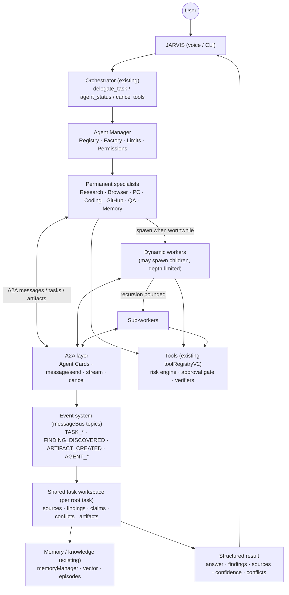
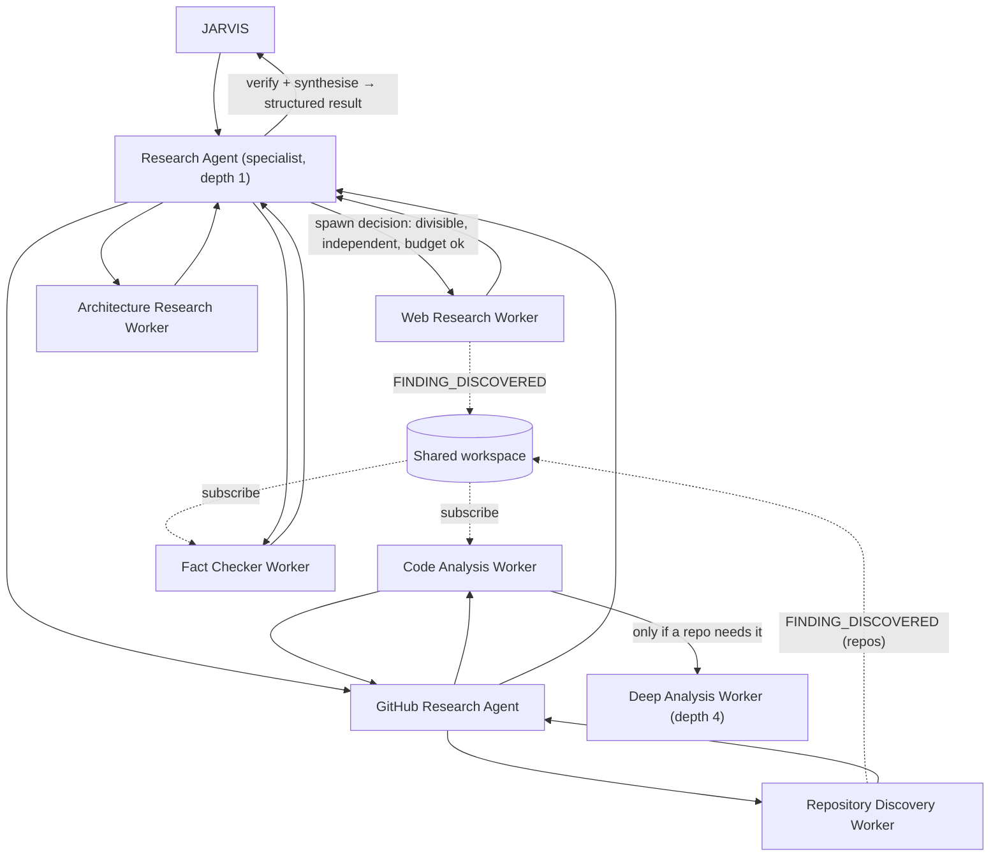

# JARVIS Multi-Agent Architecture Audit

Commit audited: `d77d0d9` (branch `claude/jarvis-repair`), 2026-10-08.
Source: this repository's code, plus `JARVIS_CURRENT_SYSTEM_ARCHITECTURE_REPORT.md` (the current-state report). Written **before** any multi-agent code was added.

Classification:

- **EXISTS** — implemented and usable as is;
- **PARTIAL** — something related exists, but not what is required;
- **MISSING** — nothing exists;
- **BROKEN** — exists but fails;
- **NOT VERIFIED** — exists, no runtime evidence on the owner's PC.

---

## 1. The ten inspection questions

| # | Question | Finding |
|---|---|---|
| 1 | Existing JARVIS architecture | One Node/TypeScript process. One orchestrator, one global state machine, 60 tools behind one gated registry, Python voice services over a local WebSocket bridge, JSON + vector + Redis memory |
| 2 | Existing agent abstractions | **None.** `agents/researchAgent.py` is one comment line. `_legacy/agents/*` are empty files, and `supervisorAgent.ts` is a stub that throws "Agent routing is not yet implemented" (quarantined, unreachable). `control/browserAgent.ts` is a module of browser action functions. `AgentStateMachine`, `AgentTool` and `agentMemory` are the single assistant's state, tool interface and memory |
| 3 | Existing orchestrator | `core/orchestrator.ts` → `JarvisOrchestrator.process()` / `runAgentLoop()`. It handles one request at a time; a new request aborts the old one. Pipeline: fixed routes → plan (1 LLM call, ≤8 tools) → task graph → reflect → repair → synthesis |
| 4 | Existing task system | `core/taskGraphEngine.ts`: a DAG of **tool calls** per request, `_depends_on` ordering, ≤3 in parallel (hard-coded `MAX_CONCURRENCY = 3`), per-node retries, interrupt, replan guard. One global `currentGraph`; static arguments (no data between steps). `core/goalManager.ts`: one persisted goal record per request (id, status, priority, timestamps, retries; **no parent/root ids**) |
| 5 | Existing event/message bus | `core/messageBus.ts`: typed topics including `AGENT_PLAN_READY`, `AGENT_TASK_DONE`, `AGENT_REPAIR`, `AGENT_ERROR`; priorities; a log of the last 100 messages; synchronous delivery. **Defined but unused** (only `brainLoop` publishes two topics; nothing subscribes). Also: `conversationBus` (busy/speaking/idle), `agentStateMachine` events, `taskGraphEngine` events, AsyncLocalStorage contexts |
| 6 | Existing memory | `memoryManager` (lowdb: messages, ≤500 facts with semantic merge of near-duplicates), vector service (MiniLM, `127.0.0.1:8000`), Redis cache, `agentMemory` (one working context + episodes JSONL), `unifiedContextBuilder` (budgeted planning context), document memory (`rag/*`), Neo4j (off) |
| 7 | Existing tool/skill system | `toolRegistryV2.execute()`: floor → validation → risk engine → rate limit → approval → sandbox/queue → retries/fallbacks → redaction → verification. Every tool has catalogue metadata (category, risk per action). Skills are folders that become tools |
| 8 | Existing WebSocket/bridge | `bridge/nodeBridge.ts`: `ws://127.0.0.1:9000`, token auth, fixed roles `stt`, `tts`, `wakeword`, `vision`. Built for the Python voice clients; there is no agent protocol on it |
| 9 | What can be reused | See section 3 |
| 10 | What is missing | See sections 2 and 4 |

---

## 2. Required capabilities: classification

### 2.1 Agents, hierarchy, lifecycle

| Required capability | Status | Evidence |
|---|---|---|
| JARVIS as main supervisor | **EXISTS** (as a single orchestrator) | `core/orchestrator.ts` |
| Agent abstraction (identity, role, state) | **MISSING** | Section 1, row 2 |
| Seven specialist roles (Research, Browser, PC/Windows, Coding, GitHub, QA/Test, Memory) | **MISSING** as agents | No agent code |
| Underlying abilities for each role | **PARTIAL** — see 2.6 | Tools exist for most roles |
| Agent registry with discovery by capability | **MISSING** | Only a tool registry (`toolRegistryV2`, `describeCapabilities`) |
| Agent Card (id, name, description, capabilities, tools, status, version, endpoint, permissions, parent, task types) | **MISSING** | — |
| Agent Factory (create with limits, permissions, cleanup) | **MISSING** | — |
| Dynamic creation of temporary workers | **MISSING** | — |
| Recursive (worker creates worker) creation | **MISSING** | — |
| Spawn-or-do-it-yourself decision | **MISSING** | — |
| Child lifecycle CREATED → VALIDATING → STARTING → RUNNING → WAITING → COMPLETED / FAILED / CANCELLED / TIMED_OUT | **MISSING** | Task nodes have pending/running/done/failed/retry/skipped |
| Temporary worker cleanup / archive | **MISSING** | — |
| Orphan prevention | **MISSING** (no parent/child to orphan) | — |
| "Active agents" observability hook | **PARTIAL** — `healthManager.registerAgent()` and a dashboard row exist, never called | `monitoring/healthManager.ts:66-72`, `monitoring/runtimeDashboard.ts:153` |

### 2.2 Tasks, dependencies, parallelism

| Required capability | Status | Evidence |
|---|---|---|
| Task lineage (task_id, parent_task_id, root_task_id, agent_id, parent_agent_id) | **MISSING** | `Goal` has `id`, no parent/root; task nodes have no agent |
| status, created/started/completed timestamps, priority, dependencies, result, errors | **PARTIAL** | `TaskNode` and `Goal` fields |
| confidence per result | **MISSING** (only memory facts have `confidence`) | `memory/memoryManager.ts` |
| cancellation state per task | **PARTIAL** — one AbortController per request; interrupt marks the graph `interrupted` | `core/orchestrator.ts:78,236-242`, `core/taskGraphEngine.ts:547` |
| Dependency graph | **PARTIAL** — tool-call DAG only, static arguments, no data flow | `core/taskGraphEngine.ts` |
| Dependent task waits for the information it needs | **MISSING** | Static args (current-state report, part 5.4) |
| Parallel execution of independent tasks | **PARTIAL** — ≤3 tool calls in parallel; medium/high-risk tools pass a global serial queue; control actions pass `actionQueue` (one at a time); one request at a time | `core/taskGraphEngine.ts:261`, `core/toolRegistryV2.ts:763-783`, `control/actionQueue.ts` |
| Configurable limits (max children, total concurrent, depth, lifetime, token/resource budget) | **MISSING** for agents; related limits exist but are hard-coded or per-tool (`MAX_CONCURRENCY = 3`, per-tool rate limits via env, sandbox timeouts, replan guard 2) | — |
| Cancellation propagation down a tree | **MISSING** (no tree) | — |
| Worker timeout | **PARTIAL** — tool-level timeouts (25 s registry, 15/20/30 s sandbox), PLANNING watchdog 15 s | — |
| Retry / replace / continue-without failed child | **PARTIAL** — tool retries and repair strategies at plan level | `core/orchestrator.ts → repairPhase` |

### 2.3 Communication

| Required capability | Status | Evidence |
|---|---|---|
| A2A protocol (Agent Cards, tasks, messages, parts, artifacts, streaming, cancel) | **MISSING** | No A2A code or dependency |
| MCP | **MISSING** — JARVIS has no MCP client or server; its own tool registry plays that role internally | `package.json` dependencies |
| Internal event infrastructure | **PARTIAL** — `messageBus` with typed topics, unused; EventEmitters in core modules | `core/messageBus.ts` |
| Event types TASK_CREATED … AGENT_STOPPED | **MISSING** (topics differ; none published for tasks) | — |
| Streaming of task progress | **MISSING** (only LLM token streaming for replies) | — |
| Parent ↔ child channel | **MISSING** | — |
| Controlled sibling communication | **MISSING** | — |
| Network transport for agents | **PARTIAL** — the voice bridge is token-protected but role-limited and voice-specific; not suitable as an agent bus | `bridge/nodeBridge.ts` |

### 2.4 Shared state, results, conflicts

| Required capability | Status | Evidence |
|---|---|---|
| Shared workspace per root task (question, graph, sources, facts, claims, evidence, citations, artifacts, results, conflicts, confidence, synthesis) | **MISSING** | `agentMemory` holds one working context for the whole process |
| Real-time finding sharing | **MISSING** | — |
| Duplicate-work avoidance | **PARTIAL** — 30 s tool-result cache, LLM response cache and in-flight dedupe, memory near-duplicate merge; nothing at task level | `core/toolRegistryV2.ts`, `bridge/groqProvider.ts:142-212`, `memory/memoryManager.ts` |
| Conflict detection between agents' claims | **MISSING** (memory merges near-duplicate facts by confidence; it does not detect contradictions) | `memory/memoryManager.ts` |
| Result aggregation (collect, compare, deduplicate, verify, synthesise) | **PARTIAL** — tool outputs summarised by the fast model | `core/orchestrator.ts → handleSuccess` |
| Structured result (summary, findings, sources, artifacts, confidence, limitations) | **MISSING** | — |

### 2.5 Memory, security, observability

| Required capability | Status | Evidence |
|---|---|---|
| Scoped context (JARVIS → task → agent → worker) | **MISSING** (one global working context) | — |
| Promotion of findings to long-term memory | **PARTIAL** — `memoryManager.rememberFact()` exists; nothing promotes agent results | — |
| Security gates for every action | **EXISTS** — all actions through `toolRegistryV2.execute` | current-state report, part 14 |
| Agent permission scopes and inheritance (child ≤ parent) | **MISSING** — one process-wide level (`permissionSession`) | — |
| Approval for dangerous operations | **EXISTS** (one request on display at a time) | `security/approvalGate.ts` |
| Spoken approval | **BROKEN on the owner's PC before Step E**; fix NOT VERIFIED | current-state report, 18.4 |
| Observability of active/completed/failed agents, task tree, events, findings, resources | **MISSING** (dashboard + action history exist for the single loop) | — |
| "Jarvis, what are your agents doing?" | **MISSING** | — |

### 2.6 Abilities each specialist would use (existing tools)

| Role | Existing tools | Status |
|---|---|---|
| Research | `web_search`, `deep_search`, `browser_read_page`, `search_documents` | **PARTIAL / BROKEN on the PC** (`web_search` has no `SERPER_API_KEY` there); no source extraction or fact verification |
| Browser | 15 browser tools over CDP | **EXISTS**, **NOT VERIFIED** on the PC (needs debuggable Chrome) |
| PC/Windows | `windows_overview`, `system_overview`, window/app/UI Automation/file/process tools | **EXISTS** (much of it verified, run 8) |
| Coding | `explain_code`, `read_file`, `files`, `dev`, `run_command` | **PARTIAL** — reading and running; no code-generation capability |
| GitHub | `git`, `git_overview`, `git_push` (local repository) | **PARTIAL** — no GitHub API (issues, PRs, CI, search) |
| QA/Test | `dev run test/build/lint/typecheck` | **PARTIAL** — runs scripts; no test planning or failure analysis |
| Memory/Knowledge | `search_memory`, `save_relation`, `ingest_documents`, `search_documents` | **EXISTS** |

---

## 3. What will be reused (and how)

| Existing component | Reuse in the multi-agent runtime |
|---|---|
| `toolRegistryV2.execute` + risk engine + approval gate + verifiers | **Every** agent tool call goes through it unchanged. Agents never call controllers directly |
| `core/toolCatalog.ts` metadata (category, risk per action) | Basis of agent permission scopes: a scope is a set of tool names plus a maximum risk level; a child's scope must be a subset of its parent's |
| AsyncLocalStorage pattern (`traceContext`, `taskContext`, `approvalScope`) | An agent context (agent id, task id, root id) per running agent, so tool calls and approval requests say which agent asked |
| `core/messageBus.ts` (typed, unused) | Extended with the agent/task event topics; it becomes the in-process event bus for agents |
| `modelRouter` (redaction, failover, 429 handling) | All agent LLM calls, behind an agent-level LLM concurrency limit (the Gemini free tier allows few requests per minute) |
| `memoryManager.rememberFact`, `unifiedContextBuilder`, `agentMemory.pushEpisode` | Promotion of verified findings; scoped context for the specialist; episode records |
| `healthManager.registerAgent` + dashboard row | Active agents shown in the existing dashboard |
| Orchestrator fixed routes and tool selection | Delegation and agent status reached through new registry tools and routes, without changing the existing loop |
| `goalManager` | The user's request keeps its goal record; the agent task tree hangs below it by `root_task_id` |

**Not reused, with reasons:**

- **`taskGraphEngine` for agent tasks.** Its nodes are tool calls with fixed arguments. It keeps one global `currentGraph` that the interrupt handler aborts. Its concurrency is a hard-coded 3, and its replan guard is keyed by goal text. Agent tasks need lineage, per-task cancellation, data handed between tasks, and configurable limits. A separate agent task graph will use the same ideas (ready-set scheduling, dependencies, retries) without changing the existing engine, which keeps serving the orchestrator's plans.
- **The voice WebSocket bridge as an agent transport.** It is role-limited and carries audio-control traffic. A2A traffic gets its own transport: in-process by default, and an optional localhost HTTP endpoint (part of Phase 2).

---

## 4. What is missing (the work list)

1. Agent model: A2A-shaped Agent Card, agent instance, lifecycle states.
2. Agent registry (discovery by capability and task type) and agent factory (limits, permission inheritance, cleanup).
3. Agent task manager: lineage, dependencies with data hand-off, scheduler with configurable concurrency, timeouts, cancellation tree, retries, orphan prevention.
4. Event model on `messageBus`: TASK_CREATED … AGENT_STOPPED, plus per-root streaming subscription.
5. Shared workspace per root task: sources, findings, claims, evidence, artifacts, conflicts, decisions; real-time subscription; duplicate detection.
6. A2A layer: Agent Cards, `message/send`, `message/stream`, `tasks/get`, `tasks/cancel`; in-process transport, optional localhost HTTP.
7. Seven specialists with worker roles, a spawn decision, LLM-based planning and extraction (rule-based fallback), and aggregation with conflict handling.
8. A GitHub API read tool (for the GitHub and Research agents).
9. JARVIS integration: delegation tool, status and cancel tools and routes, announcement of results by voice, memory promotion, dashboard.
10. Tests for all of the above, and the full existing suite kept green.

---

## 5. Constraints that shape the design (facts)

- **One process, one approval display, one permission session.** Parallel agents asking for approval queue at the single gate. Agent permissions can only narrow what the session allows.
- **LLM quota.** Gemini free tier on the owner's PC: few requests per minute (`bridge/groqProvider.ts:12`). Many workers making LLM calls at once would hit 429s, so agent LLM calls need their own concurrency limit and a budget.
- **Slow PC.** 2010 iMac, Windows 10, hard disk: PowerShell probes take seconds.
- **Serial queues for actions.** Medium/high-risk tool executions are serialised by the registry, and PC control by `actionQueue`. Parallelism therefore pays off for research and reading, not for PC actions.
- **Long work vs voice.** Agent tasks can take minutes. The orchestrator's tool calls time out after 15–30 s, so delegation must start the task and report back later, not block one tool call.
- **Web search** needs `SERPER_API_KEY` (missing on the owner's PC). The GitHub API without a token allows 10 search requests per minute.

---

## 6. Target architecture (to be built; not current)

The external research that decides how A2A and other projects are used is in `RECURSIVE_AGENT_RESEARCH.md`.

## Status after implementation

This audit describes JARVIS before the multi-agent work and is kept as it was. The capabilities marked MISSING above are now implemented and tested; see [docs/upgrade/MULTI_AGENT_SYSTEM.md](docs/upgrade/MULTI_AGENT_SYSTEM.md) and [JARVIS_MULTI_AGENT_IMPLEMENTATION_REPORT.md](JARVIS_MULTI_AGENT_IMPLEMENTATION_REPORT.md), which also list what is still not verified.
