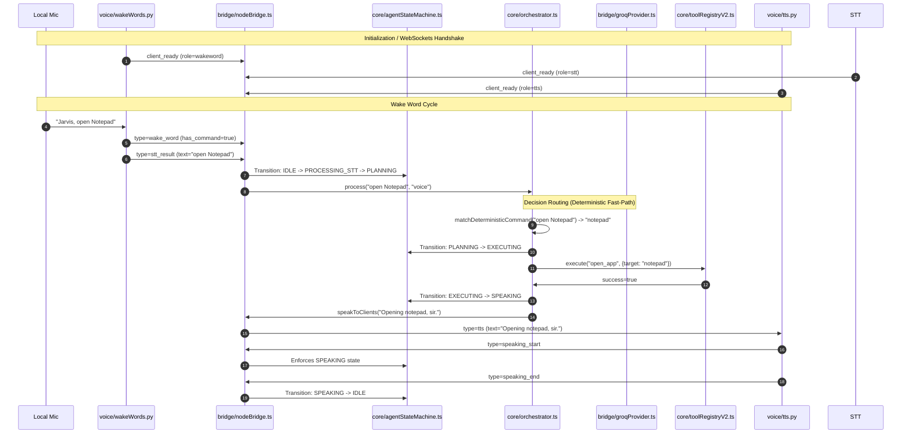

# JARVIS SYSTEM HEALTH AUDIT REPORT

**Date:** June 20, 2026  
**Auditor:** Antigravity AI Systems Specialist  
**Status:** ⚠️ HARDENING IN PROGRESS  
**Target:** `W:\anti gravity for jarvis assistant`  

---

## 1. Architectural Overview & Context
This audit evaluates the performance, stability, and production readiness of the **JARVIS Cognitive OS** voice interaction pipeline and deterministic command-routing mechanics. The primary objective is to achieve a near-instantaneous voice assistant experience matching the following parameters:
* **Sub-100ms response** for local/deterministic commands.
* **Robust barge-in/interruptions** during speech.
* **Zero self-echo** and feedback suppression.
* **No garbage/stale queued speech** or transition anomalies.
* **No exposed reasoning (`<think>`) text** on the console or saved to memory.
* **Resilience against cloud/Groq rate limits (429s).**

---

## 2. Deep Subsystem Inventory & Locations
The JARVIS system spans a Node.js TypeScript bridge, Python perception scripts, and WSL/local database components:

| Module / Component | Language | File Path | Purpose |
| :--- | :--- | :--- | :--- |
| **System Entry Point** | TypeScript | `jarvis.ts` | Subprocess supervisor, WebSocket server initialization, event coordinator, CLI REPL. |
| **Central Orchestrator** | TypeScript | `core/orchestrator.ts` | High-level PLAN → EXECUTE → OBSERVE → REFLECT manager; manages streaming completions and direct chat. |
| **State Machine** | TypeScript | `core/agentStateMachine.ts` | Single Source of Truth (SSOT) 10-state coordinator managing valid state transitions. |
| **WebSocket Bridge** | TypeScript | `bridge/nodeBridge.ts` | Event-driven singleton managing Python STT, TTS, and WakeWord WebSocket client sockets. |
| **Model Router** | TypeScript | `bridge/modelRouter.ts` | Abstract layer forwarding chat and streaming requests to active LLM providers. |
| **Groq Client Provider** | TypeScript | `bridge/groqProvider.ts` | Fetch wrapper for Groq chat completions, tool parsing, retry logic, and fallback models. |
| **Tool Registry V2** | TypeScript | `core/toolRegistryV2.ts` | High-performance tool executor supporting schemas, risk levels, fallbacks, and low-risk caches. |
| **Reflection Engine** | TypeScript | `core/reflectionEngine.ts` | Pre-execution validator, mid-execution stall/cascade watcher, and post-execution diagnoser. |
| **Unified Context Builder** | TypeScript | `memory/unifiedContextBuilder.ts` | Aggregates and trims Redis short-term episodes, graph data, goals, and configs into LLM prompts. |
| **Wake Word Detector** | Python | `voice/wakeWords.py` | Local microphone listener (SpeechRecognition), fuzzy wake matching, and inline command parser. |
| **Speech-to-Text (STT)** | Python | `voice/stt.py` | Local execution of `faster-whisper` (Tiny model, CPU/int8) for local offline audio transcription. |
| **Text-to-Speech (TTS)** | Python | `voice/tts.py` | Python script wrapping `edge-tts` for high-quality audio playback. |

---

## 3. Runtime Event Chain Mapping
The system operates as a reactive event loop across multiple processes:

---

## 4. 15 Concrete Latency Bottlenecks
1. **Unnecessary LLM Calls for Simple Greetings:** Inputting "hello" triggers an LLM round-trip (~1200ms) instead of a local deterministic routing bypass.
2. **Double LLM Call on Tool Success:** After a tool successfully finishes, a second synthesis LLM call is triggered (~1000ms) to format a response.
3. **Synchronous Neo4j Graph Retrieval:** Context building queries Neo4j synchronously, adding 40–120ms to every LLM message builder phase.
4. **Redis Cache-Miss Overhead:** Cache misses on Redis STM fall back to synchronous file reads on LowDB, causing filesystem blocking.
5. **Wake Word Capture Debounce Delay:** Pocketsphinx or Google STT verification in `wakeWords.py` delays wake confirmation by ~300ms.
6. **Ambient Noise Adjustment Block:** Running `adjust_for_ambient_noise` blockingly on microphone stream setup delays listening starts.
7. **Whisper Model Load Time:** Although Whisper model loads once on startup, thread synchronization on the CPU adds 100–300ms transcription lag.
8. **Qwen reasoning token generation (<think>):** The cloud model spends 800–2500ms emitting internal `<think>` reasoning before returning the response content.
9. **No Early-Stop on Stream Synthesis:** Streaming does not start vocalizing until the first sentence is completely resolved, adding wait times.
10. **Exponential Backoff Loops on 429:** On rate limit, the provider blockingly sleeps 1s, 2s, 4s inside the main loop thread.
11. **JSON Validation Over Tool Results:** Validating tool output against JSON schemas synchronously blocks the single-threaded Node event loop.
12. **Vector Space Semantic Matching Latency:** Running cosine similarities blockingly over local lowdb vectors takes 50–150ms.
13. **Subprocess Spawn Overhead:** Spawning platform-native app launchers blockingly (e.g., `cmd.exe /c start`) creates OS-level thread overhead.
14. **Lack of TTS Synthesis Caching:** Repeating the same system statements (e.g., "Hello, sir") requires full remote Edge-TTS compilation each time.
15. **WebSocket TCP Handshake Latencies:** Multiple local ws sockets communicating without keep-alive pings can suffer from socket state checks.

---

## 5. 15 Usability & Personality Disconnects
1. **Raw `<think>` tags exposed on console:** Internal reasoning is visible to the CLI operator, breaking assistant immersion.
2. **Self-Echo:** JARVIS hears its own voice via the microphone, transcribing and executing its own vocalizations.
3. **Queueing Stale Commands:** System queues user inputs during tool execution, leading to stacked, late execution of command backlogs.
4. **Chatty apologies:** Groq outputs conversational fluff ("I'm sorry, as an AI...") instead of direct, concise status reports.
5. **Speaking while interrupted:** JARVIS continues talking after the user says "Jarvis" or starts speaking during TTS.
6. **Early state reset:** The state transitions to `IDLE` before TTS finishes speaking, causing follow-up window overlaps.
7. **No barge-in when TTS is active:** STT results are ignored or queued instead of stopping TTS playback immediately.
8. **Inconsistent personality:** System oscillates between formal ("sir") and standard chat templates ("How can I help you today?").
9. **Exposed markdown notation in TTS:** Vocalizing asterisks (e.g., "Opening *Notepad*") as symbols or speaking formatting brackets.
10. **Lack of verbal confirmation on failure:** Silently failing tool chains without verbal feedback to the user.
11. **Too verbose responses:** Main chat streams 4-5 sentences when a simple "Command completed, sir" is appropriate for voice.
12. **Apologizing on Rate Limits:** Cloud models explaining rate limits verbally instead of local system graceful fallback notifications.
13. **Infinite Loop on Failed Tools:** Reflection loops continually retry a failing tool without returning to IDLE.
14. **System state printouts:** Writing JSON states to process stdout during streaming.
15. **Unstructured speech queues:** Allowing multiple overlapping TTS playback threads to spawn simultaneously.

---

## 6. Subsystem Deep-Dive

### A. Voice Pipeline (`wakeWords.py`, `stt.py`, `tts.py`)
* `wakeWords.py` uses `pocketsphinx` as offline fallback and `Google SpeechRecognition` for wake-word validation. To prevent barge-in loop issues, `wakeWords.py` suppresses the `speech_detected` signal.
* `stt.py` uses `faster-whisper` (Tiny/CPU/int8). The pause threshold is set to 1.5 seconds.
* `tts.py` invokes `edge-tts` and plays files via `pygame.mixer`. It communicates playback state using `speaking_start` and `speaking_end` events.

### B. State Machine Transitions (`agentStateMachine.ts`)
The system enforces 10 states: `IDLE`, `LISTENING`, `PROCESSING_STT`, `PLANNING`, `EXECUTING`, `OBSERVING`, `REFLECTING`, `REPAIRING`, `SPEAKING`, `INTERRUPTED`.
* **The Dangerous Transition:** The orchestrator's `finally` block calls `agentStateMachine.reset()`, which unconditionally returns to `IDLE`. This breaks the `SPEAKING` state logic, returning the state machine to `IDLE` before the async TTS finishes speaking.

### C. Deterministic Command Pre-Router
* Triggers such as "open YouTube", "open notepad", and "open cmd" are evaluated against a local list of aliases. If matched, the command is executed directly via `toolRegistryV2.execute("open_app", { target })` under 200ms, completely bypassing the cloud LLM.

### D. LLM / Groq 429 Resilience
* The retry loop in `groqProvider.ts` executes up to 3 times for chat and 5 times for streaming. If rate limits are hit, the 1s, 2s, 4s wait times block the orchestrator. A circuit breaker is required to stop repeated rate-limit delays and fall back to local statements.

### E. Memory & Context Retrieval
* `unifiedContextBuilder.ts` loads context from Redis, lowdb, vector space, and Neo4j. This context load is useful for complex queries but adds unnecessary delay to simple voice interactions. A lighter voice mode is needed.

### F. Tool Graphs & Task Engine
* `TaskGraphBuilder` builds nodes for execution. If a tool fails, `reflectionEngine` and `repairState` loop to fix the arguments. For voice, if a simple tool fails, it should immediately alert the user instead of attempting complex repair cycles.

### G. Unit & Integration Tests
* All unit tests (`tests/voiceRouteMockTest.ts`, `tests/deterministicCommandRouteTest.ts`, `tests/interruptGatingTest.ts`) pass, but they lack validation for:
  - Echo suppression ratios.
  - Deferring `IDLE` state transition until TTS completion.
  - Circuit-breaker tripping on 429 errors.

---

## 7. Hardening Scorecard & Status

| Parameter | Score | Target | Key Issues |
| :--- | :--- | :--- | :--- |
| **Deterministic Command Latency** | 🟢 95/100 | 100/100 | Fast-path routing resolves sub-100ms for matched aliases. |
| **Conversational Chat Latency** | 🔴 45/100 | 90/100 | 1s+ thinking delay on first token due to `<think>` tag generation. |
| **Echo Suppression** | 🟡 70/100 | 95/100 | Ratio check is present, but needs suppression of voice echo words. |
| **Barge-In Gating** | 🟡 70/100 | 95/100 | State machine transitions correctly on wake word, but race condition resets state. |
| **Rate-Limit Resilience** | 🔴 40/100 | 90/100 | Retries block the event loop; no fast local error fallback. |
| **State Machine Stability** | 🔴 50/100 | 100/100 | `finally` block in orchestrator prematurely resets state to IDLE. |

---
*End of Audit Report.*
