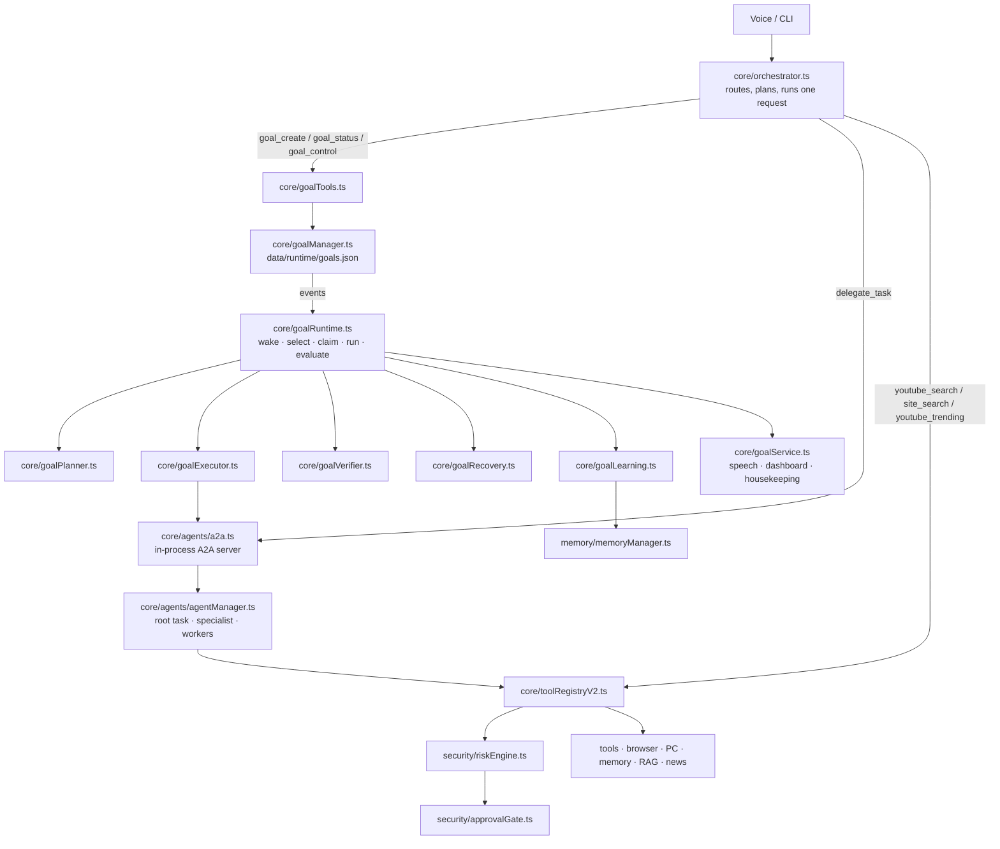
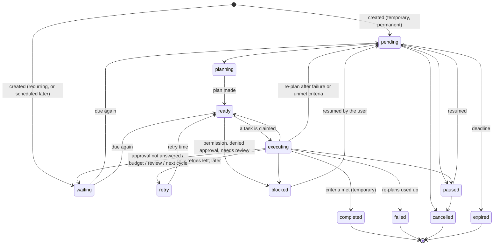
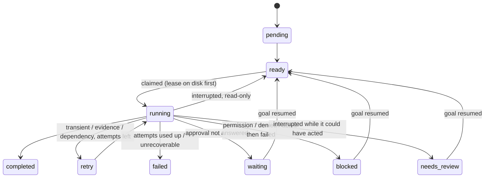
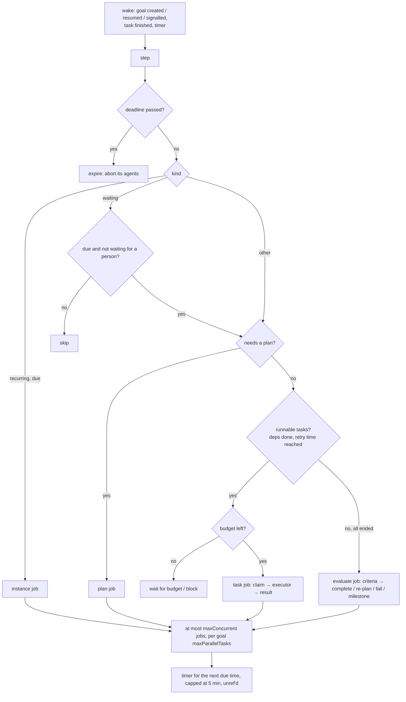
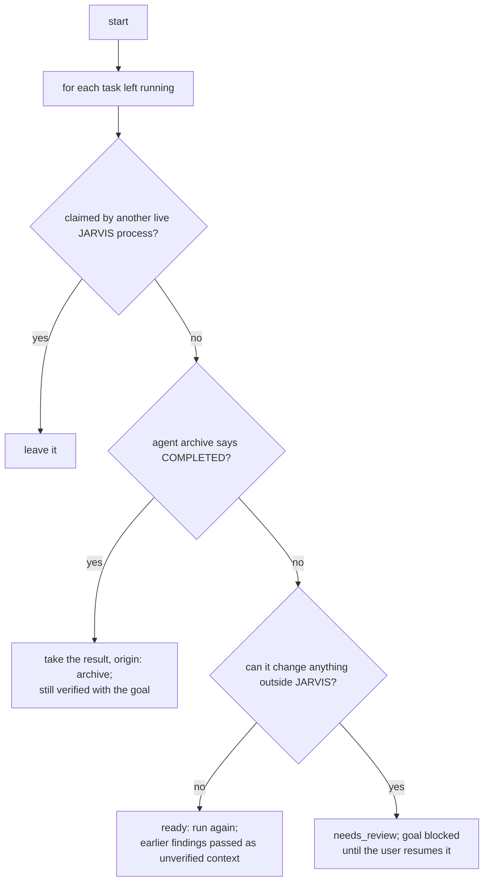
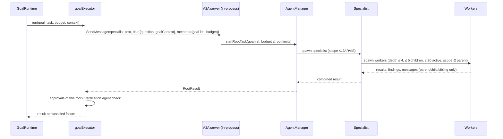

# Goal Runtime, background research and desktop control

What was built on branch `claude/jarvis-repair` on top of the existing JARVIS architecture. The plan and the Phase 0 audit are in [`GOAL_RUNTIME_PLAN.md`](GOAL_RUNTIME_PLAN.md).

## 1. What it does

- **Goals that run without a new message.** A goal is stored, planned into tasks, run by the specialist agents, checked against its success criteria, and finished, retried, re-planned, paused, blocked or failed — also after JARVIS restarts.
- **Three kinds of goal.** Temporary (finish once), permanent (work through milestones, never "done" by a milestone), recurring (one run per due time).
- **Background research.** Current news and "what is trending" are answered from dated sources without touching the screen.
- **Desktop control on request.** YouTube searches, opening the best-matching video, play/pause, and site searches in Chrome, each checked on the page afterwards.

Every action an agent takes for a goal still goes through the tool registry, the risk engine and the approval gate.

## 2. Files

New:

| File | Responsibility |
|---|---|
| `core/goalLifecycle.ts` | Goal and task types; the allowed status changes; failure classes |
| `core/goalSchedule.ts` | Due times: once, interval, daily/weekdays at a local time in an IANA zone (DST-safe) |
| `core/goalRuntime.ts` | The worker and scheduler: wake-ups, claims, jobs (plan, run task, evaluate, recurring instance), restart reconciliation, status |
| `core/goalPlanner.ts` | Plans a goal or milestone into tasks with the model; checks the plan; falls back to one task |
| `core/goalVerifier.ts` | Checks success criteria against the results; the model as judge, or the user when no model |
| `core/goalRecovery.ts` | Failure classes → retry with backoff, wait, re-plan, block, fail |
| `core/goalExecutor.ts` | Runs a task as an agent root task over the in-process A2A server; reads approvals and the Verification agent's check; reads agent archives after a restart |
| `core/goalLearning.ts` | Lessons from verified outcomes and feedback; retrieval for planning; effect tracking; improvement proposals |
| `core/goalTools.ts` | `goal_create`, `goal_status`, `goal_control`; schedule phrases; status text |
| `core/goalService.ts` | The runtime inside JARVIS: start/stop, speech, dashboard line, housekeeping (memory decay) |
| `core/delegationRouting.ts` | Which requests are foreground, background, delegated, or goals |
| `core/desktopRouting.ts` | Plain YouTube / site-search / trending phrases |
| `control/youtubeControl.ts` | YouTube search, best match, play/pause, through CDP with fixed page scripts (added to `perception/cdpScripts.ts`) |
| `core/tools/youtubeTools.ts` | `youtube_search`, `youtube_play`, `site_search` |
| `core/tools/webResearchTools.ts` | `news_search`, `youtube_trending` |
| `core/agents/behaviors/news.ts` | The Research agent's current-events path |

Changed (main points):

| File | Change |
|---|---|
| `core/goalManager.ts` | Goal kinds; every status change through the lifecycle with a reason; managed goals never dropped by the 100-request window; archive instead of delete; immediate writes for claims; lessons; injectable clock |
| `core/orchestrator.ts` | Request goals change status through the lifecycle; goal, desktop and background routes; delegation offered by request type; honest "ready" log instead of "autonomy loop active" |
| `core/brainLoop.ts`, `jarvis.ts` | Honest startup lines; Goal Runtime and scheduled backups started and stopped; `goals` CLI command; shutdown pauses only request goals; dead Python-reflection block removed |
| `core/agents/agentManager.ts`, `agentScope.ts`, `a2a.ts` | A root task can carry its goal and task ids (in-process callers only) and a budget |
| `security/approvalRequest.ts`, `approvalGate.ts`, `core/toolRegistryV2.ts`, `core/traceContext.ts` | Approval requests and decisions name the goal and task; a goal's request ignores answers typed in its first 1.5 s |
| `core/agents/jarvisAgents.ts` | Number lists with "analyse/trend" go to the Data agent |
| `core/agents/specialists.ts`, `behaviors/research.ts` | Research gets `news_search`, `youtube_trending`; Browser gets the YouTube/site tools; current-events questions take the news path |
| `core/verifiers.ts`, `core/toolCatalog.ts`, `core/tools/index.ts` | Checks and metadata for the new tools; registration |
| `perception/cdpClient.ts`, `perception/cdpScripts.ts` | `evaluateFixed` can run a fixed script with a user gesture (media `play()`); the YouTube page scripts |
| `memory/memoryManager.ts` | `decayMemory()` decays each day once, so it can run on a schedule |
| `system/backupRestore.ts` | Goal store included; interval setting; unique snapshot folders |
| `monitoring/runtimeDashboard.ts` | A GOALS line |

## 3. Architecture



The orchestrator still serves the user's own request and is not used by the runtime: `orchestrator.process()` aborts the request before it, so background work goes through the agent system, which runs beside the foreground request in its own AsyncLocalStorage scope.

## 4. Goal lifecycle



The full table is `GOAL_TRANSITIONS` in `core/goalLifecycle.ts`; every change records from, to, reason and time in the goal's history, and a change not in the table is refused and logged.

Request goals (every typed or spoken command) use the same table but are never run by the runtime.

### Task lifecycle



### Kinds

| | Temporary | Permanent | Recurring |
|---|---|---|---|
| Ends | completed, failed, cancelled, expired | only when cancelled (blocked after repeated failed cycles until resumed) | only when cancelled |
| Unit of work | the whole plan | one milestone per cycle | one temporary instance per due time |
| Between runs | — | `waiting` for the next cycle (`reviewIntervalMs`, `maxCyclesPerDay`) | `waiting` for the next due time |
| No work left | completed after verification | proposes the next milestone (model) or waits for the user to add one | — |
| Repeated failure | re-plan up to `maxRetries` rounds, then failed | `maxConsecutiveFailures` failed cycles → blocked | each instance on its own |
| Duplicates | — | — | instance key `template@due-time`, unique (also against the archive); no new instance while the last is active; after downtime one catch-up run (`catchUp: 'one'`) or none |

## 5. The worker



- There is no polling loop: one timer for the next due time, and wake-ups on events.
- A task claim (`running`, attempt id, lease) is written to disk before the agent starts. A result for an attempt that is no longer current is ignored.
- A goal that starts more than 60 jobs in a minute is paused (loop guard).
- `stop()` aborts running jobs, waits up to 5 s, records the rest as interrupted and releases claims.

## 6. Restart and retry



| Failure class | Example | What happens |
|---|---|---|
| transient | network, 429/503, timeout, too many agent tasks | retry after 30 s × 4ⁿ (max 30 min), up to 3 attempts |
| evidence | Verification agent found issues; weak sources; criteria unmet | retry with advice; then re-plan |
| dependency | a service it needs is down | retry later (double backoff) |
| invalid_plan | unknown specialist, cannot work as planned | re-plan with advice |
| permission | needs full control mode; policy refusal | blocked, reason shown |
| approval | denied → blocked; not answered → waiting (not failed) | user resumes to be asked again |
| budget | goal budget used | waiting for the daily budget, or blocked |
| interrupted | pause, shutdown, restart | read-only → ready; could have acted → needs review |
| unrecoverable | anything else | task failed; the goal re-plans or fails |

A task that may act (desktop, browser, code changes) is repeated automatically only if the failed attempt made no tool call. Exactly-once execution is not promised: an action that started just before a crash cannot always be known to have happened; such tasks wait for the user instead of being repeated.

Three recovery layers, three jobs: `core/recoveryPlanner.ts` + `core/reflectionEngine.ts` repair one request's steps within seconds; `core/goalRecovery.ts` handles goal-tasks across minutes, hours and restarts; `self_healing/recoveryPlanner.ts` restarts JARVIS's own services. A goal-task never runs the orchestrator's step repairs.

## 7. Agents and A2A



- Goal ids and budgets are accepted only from JARVIS's own in-process caller; the optional HTTP A2A endpoint cannot claim a goal.
- Pausing or cancelling a goal cancels its root task and everything below it.
- Agent root tasks are archived to `data/agents/<root>.json` with their goal; after a restart they are read as evidence, not as proof.

## 8. Approvals

```mermaid
sequenceDiagram
    participant W as Agent (for goal G, task T)
    participant R as Tool registry
    participant K as Risk engine
    participant A as Approval gate
    participant U as User
    W->>R: tool call (AsyncLocalStorage: agent ids + goal G/T)
    R->>K: assess
    K-->>R: level ≥ 2 (policy ask) or ≥ 3 → approve
    R->>A: request (ACTION, WHY, FOR GOAL: G, task T)
    Note over A: one request on display at a time;<br/>typed answers for a goal's request count after 1.5 s
    A->>U: console / voice
    U-->>A: answer (or none)
    A-->>R: decision recorded with root task, goal and task ids
    R-->>W: runs, or APPROVAL_DENIED
```

- Level-4 actions still need the typed code; voice cannot approve them.
- The executor reads the decisions for its own root task only, so one goal's answer cannot settle another's request.
- An unanswered request leaves the goal `waiting`; it asks again only when the user resumes the goal.

## 9. Storage

| Where | What |
|---|---|
| `data/runtime/goals.json` | Request goals (newest 100), managed goals with tasks, leases, attempts, results, failures, checkpoints, milestones, schedule, budget/usage, history; lessons; archive index |
| `data/runtime/goal-archive/<id>.json` | Finished managed goals after `JARVIS_GOAL_RETENTION_DAYS` (default 7) |
| `data/agents/<root>.json` | Agent root tasks (existing), now with the goal they served |
| `memory/jarvis_memory.json` | Lessons from failures and user feedback, repeated-problem notes |
| `data/backups/<time>/` | Snapshots every 6 h, goal store included; 5 kept |

## 10. Routing

| Request | Goes to |
|---|---|
| "open YouTube and search for …", "play … on YouTube", "play/pause the video", "open Wikipedia and search for …" | the desktop route (new tab; checked on the page) |
| "what's trending on YouTube (in Pakistan)" | `youtube_trending` (off-screen) |
| "research …", "… in the background", "… while I work" | a specialist via `delegate_task` |
| research/analysis/report/multi-step requests | the planner is offered `delegate_task` and decides |
| "make it a goal to …", "every morning at 9, …", "keep improving …" | `goal_create` |
| "goal status", "pause/resume/cancel/confirm goal …" | the goal tools |
| short or simple requests | answered directly, no agents |

## 11. Learning

Lessons come only from evidence: a task that failed and then worked (what changed), a goal that failed (why), and the user's correction (`goal_control feedback`). Plain successes store nothing. Lessons similar to a new goal go into its plan; each lesson counts the goals that used it and how they ended, and one followed by more failures than successes (by 3) is no longer offered. Three failures of one kind for one specialist within a week produce a suggestion in `goal status`; nothing is changed automatically.

## 12. Background research and trending

- `news_search`: Serper's Google News endpoint, last day/week/month; each item has source, date and link; the retrieval time is stated.
- `youtube_trending`: with `YOUTUBE_API_KEY`, YouTube Data API v3 `videos.list chart=mostPopular` for a region and category, with the view counts the API reports at retrieval time. Without it, Serper video search results from the last week, labelled "NOT YouTube's ranking" and without view counts. YouTube retired its Trending page in July 2025.
- The Research agent's current-events path summarises only from the items found, citing them, and says the articles were not opened.

## 13. Health, events, recovery (checked, not merged)

- **Health:** `monitoring/healthManager.ts` builds the dashboard snapshot; `self_healing/healthChecker.ts` feeds the pipeline registry and alerts that drive restarts. Both ping Redis and read the vector supervisor (cheap, local); the LLM status is shared through `bridge/llmStatus.ts`. Different jobs; left as they are.
- **Events:** `core/messageBus.ts` is the generic bus; `core/agents/events.ts` is a typed layer on it (`AGENT_EVENT`), not a third bus; `core/conversationBus.ts` tracks speaking/idle for the voice. No overlap worth merging.
- **Stubs:** `learning/*.py`, `agents/researchAgent.py`, `voice/wakeWord.py`, `memory/memoryIndexer.py` are referenced by nothing and were left untouched. Learning is `core/goalLearning.ts`; the wake word is `voice/wakeWords.py`.

## 14. Configuration

| Setting | Default | Effect |
|---|---|---|
| `JARVIS_GOAL_RUNTIME` | on | `0` keeps the runtime off (goals are kept) |
| `JARVIS_GOAL_MAX_CONCURRENT` | 2 | jobs at once across goals |
| `JARVIS_GOAL_RETRY_BASE_MS` / `_MAX_MS` | 30 000 / 1 800 000 | retry backoff |
| `JARVIS_GOAL_RETENTION_DAYS` | 7 | before finished goals move to the archive |
| `JARVIS_APPROVAL_GRACE_MS` | 1500 | typed answers to a goal's approval count after this |
| `JARVIS_BACKUP_INTERVAL_HOURS` | 6 | `0` turns scheduled backups off |
| `YOUTUBE_API_KEY` | — | YouTube's own most-popular chart |
| `SERPER_API_KEY` | — (existing) | web, news and video search |
| `JARVIS_REGION` | US | default region for trending |
| Goal policy (per goal) | parallel tasks 2, review 24 h, 4 cycles/day, 3 failed cycles, catch-up one | set through `goal_create` / the goal record |
| Task attempts | 3 | per task; `maxRetries` 3 plan rounds per goal |
| Agent limits | existing `JARVIS_AGENT_*` | depth, children, active agents, root budgets |

## 15. Commands (Windows CMD)

```
cd C:\path\to\anti-gravity-for-jarvis-assistant
pnpm install
pnpm typecheck
pnpm test:ci
npx tsx tests\goalRuntimeTest.ts
npx tsx tests\goalAgentIntegrationTest.ts
npx tsx tests\desktopControlTest.ts
pnpm dev
```

In JARVIS (typed or spoken):

```
make it a goal to compare three note-taking apps and recommend one
every morning at 9, research the latest AI agent news
goal status
goals
pause the goal about AI news
resume goal
open YouTube and search for Python tutorials
play lofi hip hop on YouTube
pause the video
what is trending on YouTube in Pakistan
research the latest developments in AI agents in the background
```

## 16. What is verified, and what is not

| Area | Offline tests (scripted model, stand-in network) | Real integrations |
|---|---|---|
| Lifecycle, schedules, retention, archive | `goalLifecycleTest` | — |
| Worker, scheduler, retry, restart, budgets, recurring, permanent | `goalRuntimeTest`, `goalRecoveryTest` | — |
| Agents, A2A, workers, approvals by goal, pause, archive after restart | `goalAgentIntegrationTest` (real AgentManager, registry, risk engine, approval gate) | — |
| JARVIS wiring (planner fallback, tools, verifiers, start/stop) | `goalServiceTest` | — |
| Learning, decay, status | `goalLearningTest` | — |
| Routing | `delegationRoutingTest` | — |
| Backups | `backupScheduleTest` | — |
| YouTube search, best match, play/pause, site search | `desktopControlTest` | real headless Chromium + CDP against a local stand-in page; **not** against youtube.com |
| News and trending | `backgroundResearchTest` | **not** against Serper or the YouTube Data API |

Not verified here: live Gemini/Groq planning and judging; the real YouTube page markup; Serper and YouTube Data API responses; Windows desktop actions through goals; voice approvals for goals on real audio; two JARVIS processes sharing one data folder (claims are designed for one process; another live process's claim is left alone, not taken over).
