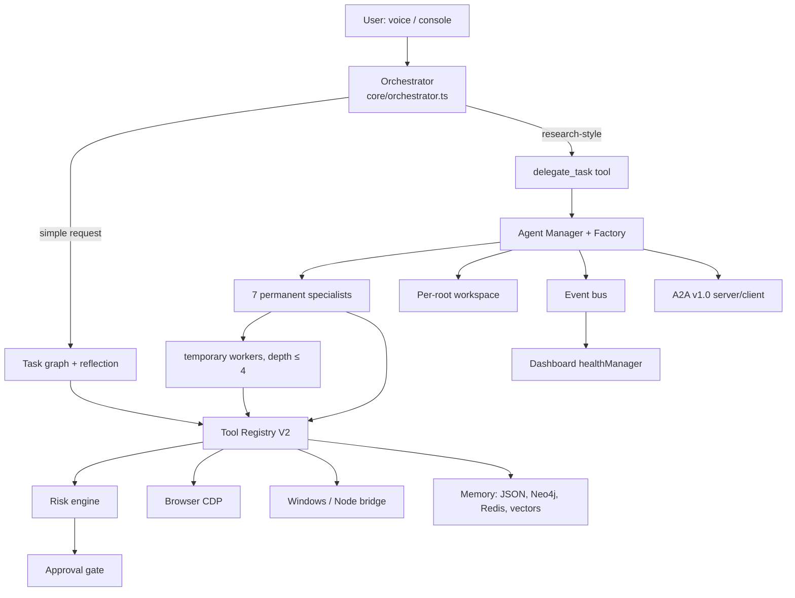

# Existing agent architecture (audit, 7A Phase 0)

Audit of what JARVIS already had on `claude/jarvis-repair` at commit `d41caa4`, before the seven-agent realignment. The question for each part: reuse, extend, or missing.

Baseline before any change: `npx tsx tests/runAll.ts --ci` → **108 passed, 0 failed, 9 skipped** (skips need Windows, PowerShell 7, or a live Chrome). `npx tsc --noEmit` clean.

## 1. Components found

| Area | Where | State |
|---|---|---|
| Main orchestrator | `core/orchestrator.ts` | Direct path for simple requests (fast routes, task graph, reflection). Offers `delegate_task` only for research-style requests. Keep. |
| State machine | `core/agentStateMachine.ts` | Foreground request states. Agents do not drive it (background work). Keep. |
| Tool registry | `core/toolRegistryV2.ts`, `core/tools/index.ts` | The only registry. Risk engine, approval gate, rate limits, redaction, verifiers, cache. Agents call tools through it. Keep, no second registry. |
| Approval gate | `security/approvalGate.ts`, `approvalRequest.ts`, `approvalScope.ts` | One request on display at a time (a turn queue); an approved call's scope is `AsyncLocalStorage`, so it cannot leak to a parallel call. Requests carry the asking agent's *path* (text), not its ids. **Gap: no `agentId`/`taskId` on the request.** |
| Agent runtime | `core/agents/agentManager.ts` (manager + factory), `taskManager.ts`, `registry.ts`, `spawnPolicy.ts`, `permissions.ts`, `semaphore.ts`, `config.ts` | Permanent and temporary agents, lifecycle `CREATED → VALIDATING → STARTING → RUNNING ⇄ WAITING → terminal`, depth/children/active/concurrency limits, budgets, retries, timeouts, stall detection, cancellation cascade, dependency cycles refused. Keep. |
| A2A | `core/agents/a2a.ts`, `types.ts` | Native A2A v1.0 server/client in-process, optional HTTP endpoint with token. Keep. |
| Messaging | `AgentMessage` in `types.ts`, `agentContextApi.ts` | Kinds: progress, partial_result, finding, artifact, warning, error, completion, cancellation, request, info. Only parent/children/siblings may message. **Gap: no assignment / acceptance / delegation_request / failure / verification kinds; no correlationId, parentTaskId, status or error fields.** |
| Shared workspace | `core/agents/workspace.ts` | Per-root: sources (deduped by URL), findings (corroboration), claims and conflicts, artifacts, results, progress, decisions, messages. **Gap: artifacts are not versioned.** |
| Events | `core/agents/events.ts` | Per-root sequence numbers, 22 event types. Keep. |
| Specialists | `core/agents/specialists.ts` | Seven permanent: research, browser, pc, coding, github, qa, memory. **Gap: the requested set differs** (see §3). |
| Behaviours | `behaviors/research.ts`, `toolLoop.ts`, `common.ts` | Recursive research flow; generic tool loop with rule fallback when no model; outside text wrapped in `<untrusted_context>`. Keep. |
| JARVIS glue | `core/agents/jarvisAgents.ts` | `delegate_task`, `agent_status`, `cancel_agent_task` tools, specialist choice by regex, spoken completion, memory write of strong findings, dashboard registration. **Gap: no independent verification step before presenting results.** |
| Memory | `memory/memoryManager.ts`, `graphMemory.ts` (Neo4j), `redisCache.ts`, `vectorMemory.py` + supervisor | Reused by `search_memory`, `save_relation`, `search_documents`. Keep; no second store. |
| Browser | `core/tools/browserTools.ts`, `browserActionTools.ts`, CDP client | Keep; no second browser runtime. |
| Desktop | `core/tools/windowsTools.ts`, `control/*Controller.ts`, Node bridge | Keep. |
| Dashboard | `monitoring/healthManager.ts` | Agents registered/unregistered by name. Keep. |
| Legacy | `agents/researchAgent.py`, `_legacy/` | Not wired into the runtime; left alone. |
| Calculation | `orchestrator.ts` lists `calculator`/`calc`/`math` as low-risk names | **Gap: no registered calculation or data-analysis tool** for a Data agent. |

## 2. Existing architecture

## 3. Mapping the requested seven roles onto what exists

| Requested role | Existing | Action |
|---|---|---|
| 1 Research & Intelligence | `research_agent` | Keep; same id. |
| 2 Software Engineering & Code Execution | `coding_agent` + `github_agent` | Merge: `coding_agent` takes the GitHub tools (incl. `git_push`, approval-gated) and the GitHub research workers. |
| 3 Browser & Web Operations | `browser_agent` | Keep; same id, new name. |
| 4 Desktop & System Operations | `pc_agent` | Keep id, new name; add a diagnostics worker role. |
| 5 Memory & Personalization | `memory_agent` (could not spawn) | Keep id; add retrieval and consistency workers. |
| 6 Data & Problem-Solving | — | **New** `data_agent` plus a safe `data_tools` tool (no `eval`, no shell). |
| 7 Verification, Security & Reliability | `qa_agent` | Keep id, new name; becomes the independent verifier. |

Ids are kept where the role maps directly so archived task trees, the dashboard and tests stay readable. `github_agent` is removed as a *permanent* role; no feature is lost because every GitHub tool and behaviour moves to `coding_agent`.

## 4. Risks found

- Removing `github_agent` breaks two tests and one route that name it. They move to `coding_agent`.
- A verification step that blocks results would make the verifier a single point of failure. It must be advisory with a time cap.
- A Data agent with a general expression evaluator would be code execution. The tool must parse arithmetic itself.
