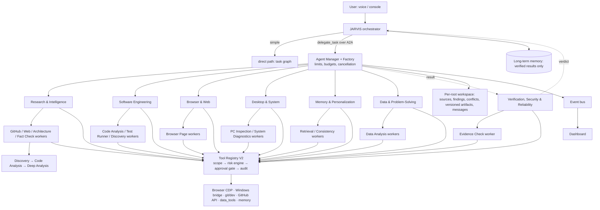

# Seven-agent system: final report

Branch `claude/jarvis-repair`, commits `8e81665` → `cde774a` on top of `d41caa4`. Phase-by-phase record: [CHECKLIST.md](CHECKLIST.md).

## 1. Final architecture

JARVIS's orchestrator stays the only entry point. Simple requests take the direct path (fast routes, task graph) as before. Larger ones go through `delegate_task` to one of seven permanent specialists over the in-process A2A layer. A specialist may create temporary workers, and workers may create their own, within the depth, child, active-agent and budget limits. Every tool call from any agent goes through Tool Registry V2: scope check, risk engine, approval gate, audit log. When a research, data or engineering task finishes, the Verification agent checks the result before JARVIS speaks it.

Nothing was replaced. No package, server, broker or database was added.

## 2. The seven permanent agents

| Id | Name | Responsibility | Risk ceiling | Workers it may create |
|---|---|---|---|---|
| `research_agent` | Research & Intelligence | GitHub and web research, comparison, fact checks, sourced answers | 1 | GitHub / Web / Architecture research agents, Fact Check |
| `coding_agent` | Software Engineering & Code Execution | Read, explain, test and (with approval) change code; git and GitHub, including the former GitHub agent's research flow | 3 | Code Analysis, Test Runner, Repository Discovery, Repository Code Analysis |
| `browser_agent` | Browser & Web Operations | Reads and navigates the Chrome debugging profile through the existing CDP bridge | 1 | Browser Page |
| `pc_agent` | Desktop & System Operations | Observes and operates Windows; diagnoses what is not working | 2 | PC Inspection, System Diagnostics |
| `memory_agent` | Memory & Personalization | Searches memory and documents; checks a fact is new before storing it | 1 | Memory Retrieval, Memory Consistency |
| `data_agent` | Data & Problem-Solving | Exact calculations, statistics, comparisons, log summaries (`data_tools`) | 0 | Data Analysis |
| `qa_agent` | Verification, Security & Reliability | Checks other agents' results and the project's tests; cannot write, commit, push or approve | 1 | Test Runner, Evidence Check |

## 3. Subagent creation and nesting

Unchanged mechanism, now used by all seven roles. The Agent Factory refuses a spawn when:

- the role is unknown or not allowed for the parent;
- depth reaches `JARVIS_AGENT_MAX_DEPTH` (default 4);
- the parent already has `JARVIS_AGENT_MAX_CHILDREN` (5) children;
- `JARVIS_AGENT_MAX_ACTIVE` (20) agents are active;
- the child would need a tool or risk level its parent lacks;
- the child would be handed the parent's whole task;
- the retry limit is exceeded;
- the budget is spent.

The spawn policy also decides whether spawning is worth it. Two tiny sums are done by the Data agent itself; two real analyses go to two parallel workers. A worker that may not spawn can send `delegation_request` to its parent, which decides; asking grants nothing.

## 4. Agent-to-agent protocol

`AgentMessage`: `id, from, to, rootTaskId, taskId, parentTaskId, correlationId, kind, text, data, status, error, at`.

Kinds: `assignment`, `acceptance`, `progress`, `request`/`info` (reply matched by `correlationId`), `partial_result`, `artifact`, `delegation_request`, `cancellation`, `failure`, `verification`, `completion`, plus the older `finding`, `warning`, `error`.

Guards:

- only parent, children and siblings may be messaged;
- a message id is delivered once;
- messages to an agent whose task ended are refused;
- messages carry no permissions, so they cannot widen a scope or answer an approval.

Transport: the in-process event bus, and A2A v1.0 for outside callers (optional local HTTP endpoint).

## 5. Shared state and coordination

There is one workspace per root task. It holds:

- sources (deduplicated by URL);
- findings (corroborated);
- claims and conflicts (settled by source quality or a fact check);
- artifacts, now versioned with `version` and `previousArtifactId`;
- results, progress, decisions and messages.

Large data moves as ids. Durable memory is written only when a root task ends, and only when verification did not find issues. Dependencies are checked for cycles when they are added. Independent tasks run in parallel under a priority semaphore, and dependent tasks wait for their inputs.

## 6. Repositories studied and patterns adopted

Details: [GITHUB_AGENT_RESEARCH.md](GITHUB_AGENT_RESEARCH.md). None is a dependency.

| Repository | Pattern taken | Where |
|---|---|---|
| microsoft/agent-framework | Concurrent fan-out with an aggregator over all results | `behaviors/data.ts` `aggregateResults` |
| browser-use/browser-use | A judge that reviews a finished run | `behaviors/verify.ts` (deterministic, not a model) |
| mem0ai/mem0 | ADD / UPDATE / NONE before storing a fact | `behaviors/memory.ts` |
| OpenHands/software-agent-sdk | Confirm by action risk; cap children; verifier without write tools | existing risk engine; `qa_agent` scope |
| langchain-ai/langgraphjs | Validation stage after workers | the verification pass |
| a2aproject/A2A | Task states and messages | existing native A2A layer; new kinds travel in metadata |

## 7. JARVIS components reused without replacement

The following were kept as they were:

- the orchestrator and its direct path;
- the agent state machine;
- LLM provider routing;
- Tool Registry V2, the tool catalog and the risk engine;
- the approval gate and approval scope;
- the security audit log;
- the browser CDP tools;
- the Windows tools and controllers;
- `memoryManager`, Neo4j relations, vectors and Redis cache;
- the health dashboard;
- the existing agent runtime (manager, task manager, registry, permissions, spawn policy, workspace, events, A2A).

## 8. Files

New:

- `core/tools/dataTools.ts`
- `core/agents/behaviors/data.ts`
- `core/agents/behaviors/memory.ts`
- `core/agents/behaviors/verify.ts`
- `tests/sevenAgentTest.ts`
- `docs/agents/` (six documents)

Changed:

- `core/agents/specialists.ts`, `jarvisAgents.ts`, `agentManager.ts`, `types.ts`, `workspace.ts`, `agentContextApi.ts`, `a2a.ts`, `behaviors/toolLoop.ts`
- `core/toolCatalog.ts`, `core/tools/index.ts`, `core/toolRegistryV2.ts`, `core/traceContext.ts`
- `security/approvalRequest.ts`, `security/securityAuditLogger.ts`
- `tests/agentRuntimeTest.ts`, `tests/agentSpecialistsTest.ts`, `tests/jarvisAgentIntegrationTest.ts`
- `docs/upgrade/MULTI_AGENT_SYSTEM.md`

28 files before this report: 1,945 lines added, 108 removed.

## 9. Tests run (real results)

| Test | Result |
|---|---|
| `tests/sevenAgentTest.ts` (new) | 86 passed, 0 failed |
| `tests/agentRuntimeTest.ts` | 102 passed, 0 failed |
| `tests/a2aProtocolTest.ts` | 56 passed, 0 failed |
| `tests/agentSpecialistsTest.ts` | 31 passed, 0 failed |
| `tests/recursiveResearchExampleTest.ts` | 32 passed, 0 failed |
| `tests/jarvisAgentIntegrationTest.ts` | 50 passed, 0 failed (after the hand-over routes) |
| `npx tsx tests/runAll.ts --ci` | 109 passed, 0 failed, 9 skipped |
| `npx tsc --noEmit` | clean |
| GitHub CI run #32 on `cde774a` | typecheck clean; 110 passed, 0 failed, 8 skipped (CI has PowerShell 7, so `windowsScriptsTest` ran); Python checks passed |

The 9 skipped tests need things this Linux container does not have:

- Windows PowerShell;
- the Windows process table and window manager;
- PowerShell 7;
- a running Redis;
- a reachable LLM API (two tests);
- `JARVIS_BRIDGE_TOKEN`;
- the Python venv.

Two problems were found and fixed during the run:

- The first verification rule flagged "the model was unavailable, rules were used" as a hidden tool failure. It was replaced by a check that confidence allows for tools that really failed.
- Status questions asked after a task ended answered about the verification task instead of the user's task. Verification tasks are now excluded from those questions.

## 10. Limitations and unfinished work

- **Not run live.** Tests use an offline network and a scripted model. Live Gemini, GitHub and Serper, the real Windows desktop and Chrome are not covered; the owner's PC is the first live run.
- **The verifier's checks are rules plus one GitHub re-read.** It does not judge whether prose is correct and does not re-read non-GitHub web pages.
- **Verification adds time before the spoken result**: up to 20 s, usually about one GitHub request. It also uses one root-task slot.
- **Agents run in one process.** Running them as separate services over A2A HTTP is possible but not set up.
- **No container sandbox for code execution.** Code runs on the PC under the existing risk engine and approval gate.
- **Deleting a memory stays a user action.** The Memory agent proposes ADD, UPDATE or NONE and never deletes.

## 11. Commands (Windows CMD)

```
cd path\to\anti-gravity-for-jarvis-assistant
git checkout claude/jarvis-repair
git pull origin claude/jarvis-repair
npx tsx tests\sevenAgentTest.ts
npm run dev
```

`sevenAgentTest` should end with `=== Results: 86 passed, 0 failed ===`.

Then say, one at a time:

- "Jarvis, ask the data agent to work out the average of 12, 15, 19 and 30" (Data agent, no model needed). Only research questions go to the agents on their own; for the others say "ask the <research | data | engineering | browser | desktop | memory | verification> agent to …", or start with "in the background,".
- "Jarvis, find the best GitHub projects for giving JARVIS browser awareness" (Research, then Verification; the console shows `Verification: …`)
- "Jarvis, remember that my exam is on Friday", then the same again (the second time: already remembered)
- "Jarvis, what are your agents doing?" while a task runs
- "Jarvis, stop this research"

Optional settings in `.env`:

- `JARVIS_AGENT_VERIFY=0` turns the verification pass off.
- `JARVIS_AGENT_VERIFY_TIMEOUT_MS=20000` caps how long verification may take.

## 12. Runtime architecture


