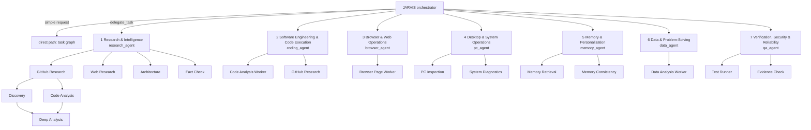
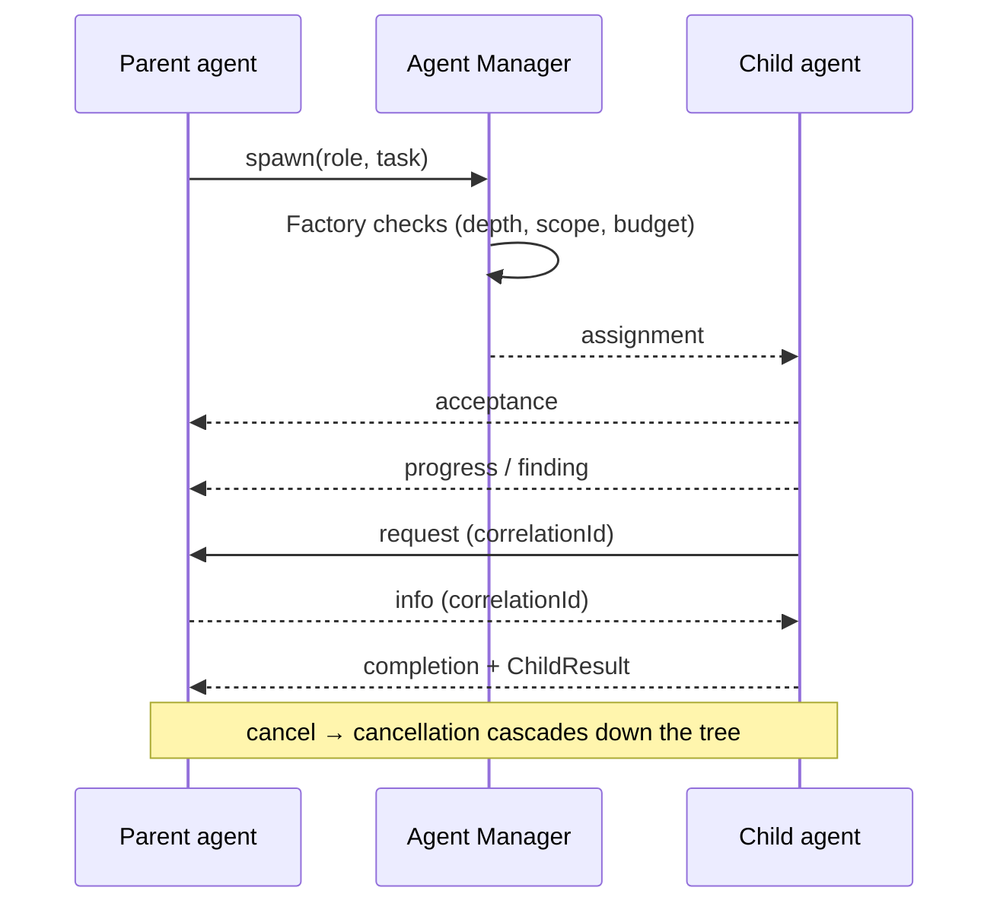
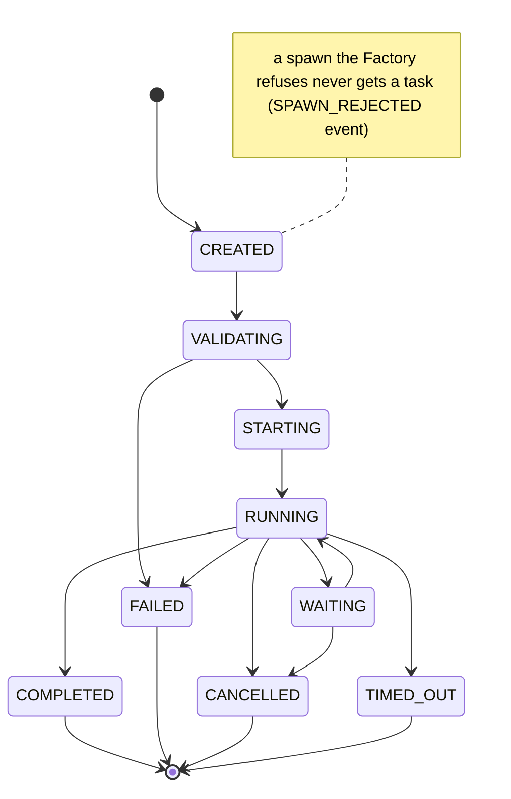
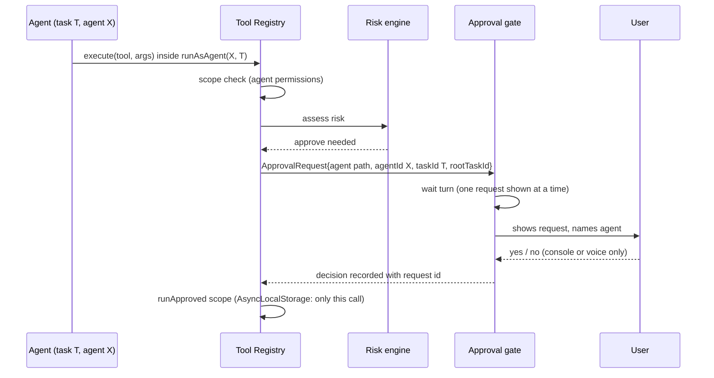

# Seven-agent design (7A Phase 0)

How the requested seven specialists fit onto the runtime that already exists (see [EXISTING_AGENT_ARCHITECTURE.md](EXISTING_AGENT_ARCHITECTURE.md)). Nothing here replaces the orchestrator, registry, approval gate, browser, desktop or memory layers.

## 1. Hierarchy

Permanent agents live in the registry for the life of the process; registering roles twice is a no-op. Temporary workers belong to one root task and are removed when it ends.

## 2. The seven specialists

| # | Id | Name | Main tools (all through Tool Registry V2) | Risk ceiling | Workers |
|---|---|---|---|---|---|
| 1 | `research_agent` | Research & Intelligence Agent | web_search, deep_search, github_search, github_repo, search_memory, search_documents | 1 | GitHub/Web/Architecture research, Fact Check |
| 2 | `coding_agent` | Software Engineering & Code Execution Agent | read_file, files, explain_code, dev, git (status/diff/log/branches/commit/switch), git_push, github_search/repo, write_file, diagnose_app | 3 (write/commit/push ask approval) | Code Analysis, GitHub Research |
| 3 | `browser_agent` | Browser & Web Operations Agent | browser_state, browser_read_page, browser_page_structure, navigate, scroll, screenshot, tabs | 1 | Browser Page Worker |
| 4 | `pc_agent` | Desktop & System Operations Agent | system/windows overview, open/focus apps, window focus/min/max, screenshot | 2 | PC Inspection, System Diagnostics |
| 5 | `memory_agent` | Memory & Personalization Agent | search_memory, search_documents, save_relation, ingest_documents | 1 | Memory Retrieval, Memory Consistency |
| 6 | `data_agent` | Data & Problem-Solving Agent | data_tools (calculate, stats, compare, log_summary), read_file, files:search | 0 | Data Analysis Worker |
| 7 | `qa_agent` | Verification, Security & Reliability Agent | dev_status, dev:scripts, dev:run, read_file, files:search, git status/diff, diagnose_app, github_repo, web_search | 1 | Test Runner, Evidence Check |

A child's tools are the intersection of its role's tools and its parent's scope; every call still passes the risk engine and the approval gate.

## 3. Subagent creation and nesting

Unchanged mechanism (`agentManager.spawn`): the Agent Factory checks role exists, parent may spawn, child role is allowed for the parent, depth < `JARVIS_AGENT_MAX_DEPTH` (4), children < `JARVIS_AGENT_MAX_CHILDREN` (5), active agents < `JARVIS_AGENT_MAX_ACTIVE` (20), tool scope ⊆ parent, risk ≤ parent, budget slice ≤ parent remaining. The spawn policy decides whether spawning beats doing the work directly. At the depth limit an agent has no spawn right at all.

## 4. Agent-to-agent messages

`AgentMessage` keeps its fields and gains optional ones; the old kinds keep working.

| Field | Meaning |
|---|---|
| `id`, `from`, `to`, `rootTaskId`, `taskId`, `at` | existing |
| `parentTaskId` | task of the sender's parent, when known |
| `correlationId` | id of the message this one answers (request → reply) |
| `kind` | existing kinds + `assignment`, `acceptance`, `delegation_request`, `failure`, `verification` |
| `status` | `ok` / `failed` / `rejected` for replies |
| `error` | `{ code, message }` with `failure` |
| `data` | structured payload |

| Requested type | Kind |
|---|---|
| Task assignment | `assignment` (sent by the manager when a child task starts) |
| Task acceptance | `acceptance` (sent when the child begins RUNNING) |
| Progress update | `progress` |
| Information request | `request` (reply carries `correlationId`) |
| Result delivery | `partial_result` / `artifact` |
| Delegation request | `delegation_request` (child asks its parent to spawn what it cannot) |
| Cancellation | `cancellation` |
| Failure notification | `failure` |
| Verification result | `verification` |
| Task completion | `completion` |

Transport stays the in-process event bus plus A2A for outside callers. No broker is added. Existing guards still apply: only parent, children and siblings may message. New: a message id already delivered is dropped (no double handling), and messages to an agent whose task has ended are refused (no stale updates). Messages never carry permissions, so a message cannot widen a scope or answer an approval.

## 5. Shared state

The per-root workspace stays the shared store; there is no global mutable memory. Additions:

- **Versioned artifacts:** an artifact with the same `name` from the same task gets `version + 1` and keeps `previousArtifactId`; earlier versions stay readable.
- Large data moves as artifact or finding ids, not copied text.
- Durable memory is written only after a root ends (strong findings), never per message.

## 6. Verification pass

After a root task completes, JARVIS asks the Verification agent to check the result when it matters: research, data and engineering results, or any result with conflicts.

- It runs as its own root task on `qa_agent` and is given only the result (answer, findings, sources, conflicts, limitations, confidence), not the workspace.
- Rule checks (`core/agents/behaviors/verify.ts`): finished; answered; every cited source present; high-confidence research findings have a source; no unsettled conflict; confidence ≥ 0.8 only with evidence; confidence ≥ 0.8 not kept when tools failed. An Evidence Check Worker re-reads one cited GitHub repository and compares the licence the answer states.
- A result with issues is not stored in long-term memory.
- It returns `verified | issues | unverified` with notes. The result is presented either way, with the notes, so the verifier is **not a single point of failure**. It has a time cap (`JARVIS_AGENT_VERIFY_TIMEOUT_MS`, default 20 s) and can be turned off (`JARVIS_AGENT_VERIFY=0`).
- It holds no tool above risk 1 and has no way to answer an approval.

## 7. Task lifecycle

## 8. Approval flow

New: `agentId`, `taskId` and `rootTaskId` on `ApprovalRequest`, from the agent scope. The gate already shows one request at a time and accepts answers only from the user's console or voice, so no agent can see or answer another agent's request.
