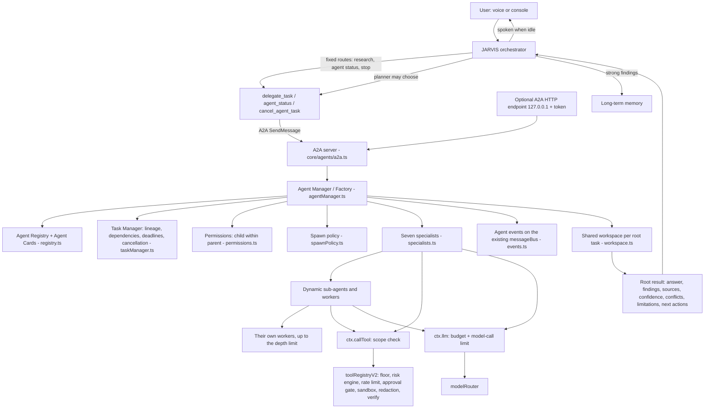
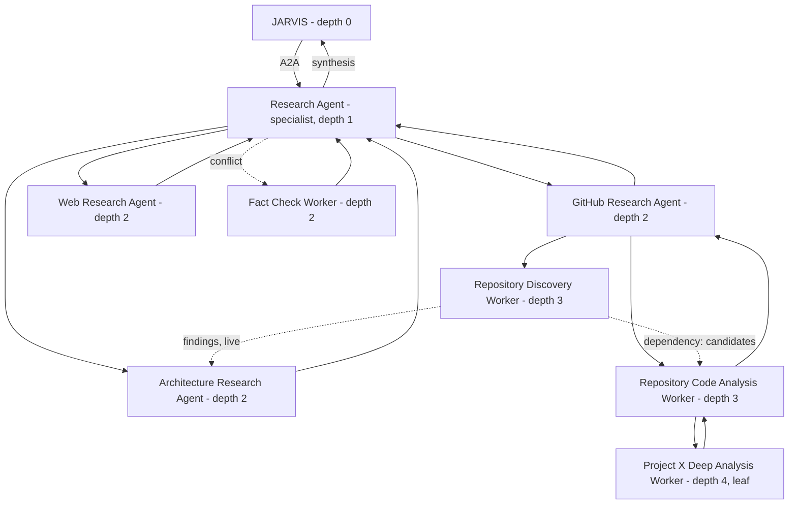
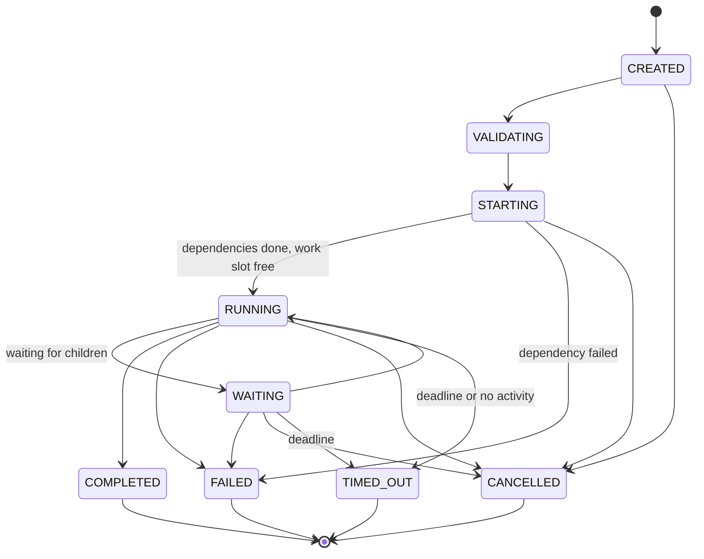

# Multi-agent system

JARVIS stays the main supervisor. For larger work it hands a request to one of seven permanent specialists. A specialist may create temporary sub-agents and workers, which may create their own, within configurable limits.

Every agent:
- works through the same tool registry, risk engine and approval gate as a voice command;
- reports to its parent, never to the user;
- shares what it finds as it finds it.

This page describes what is built. The earlier audit is `JARVIS_MULTI_AGENT_ARCHITECTURE_AUDIT.md`, and the external research behind the design is `RECURSIVE_AGENT_RESEARCH.md`.

## Architecture

## The research hierarchy

## Agents

### Seven permanent specialists

These live at depth 1, under JARVIS. Since the seven-agent realignment the set matches the requested roles: the GitHub agent was merged into Software Engineering and a Data agent was added. Design, research and checklist: [`docs/agents/`](../agents/SEVEN_AGENT_DESIGN.md).

| Id | Agent | What it does | Risk ceiling | May create |
|---|---|---|---|---|
| `research_agent` | Research & Intelligence | Web and GitHub research, comparison, fact checks, sourced synthesis | 1 | GitHub, Web and Architecture research agents; Fact Check worker |
| `coding_agent` | Software Engineering & Code Execution | Code reading and changes, tests, git and GitHub (write, commit, push ask for approval) | 3 | Code Analysis, Test Runner, Discovery and Code Analysis workers |
| `browser_agent` | Browser & Web Operations | Reads and navigates the Chrome debugging profile | 1 | Browser Page workers |
| `pc_agent` | Desktop & System Operations | Observes and operates Windows; diagnoses what is not working | 2 | PC Inspection and System Diagnostics workers |
| `memory_agent` | Memory & Personalization | Searches memory and documents; checks a fact is new before storing it | 1 | Memory Retrieval and Memory Consistency workers |
| `data_agent` | Data & Problem-Solving | Exact calculations, statistics, comparisons, log analysis (`data_tools`) | 0 | Data Analysis workers |
| `qa_agent` | Verification, Security & Reliability | Checks other agents' results and the project's tests; changes nothing | 1 | Test Runner and Evidence Check workers |

The full tool list of each role is in `core/agents/specialists.ts`.

### Worker roles

Workers are temporary: each exists for one task and is removed when its root task ends. Its record is kept in the archive.

The worker roles are:
- GitHub Research Agent
- Web Research Agent
- Architecture Research Agent
- Repository Discovery Worker
- Repository Code Analysis Worker
- Project Deep Analysis Worker
- Fact Check Worker
- Browser Page Worker
- PC Inspection Worker
- System Diagnostics Worker
- Code Analysis Worker
- Test Runner Worker
- Evidence Check Worker
- Memory Retrieval Worker
- Memory Consistency Worker
- Data Analysis Worker

## Lifecycle

**How lifecycle states map to A2A:**

| JARVIS state | A2A state |
|---|---|
| CREATED, VALIDATING | `TASK_STATE_SUBMITTED` |
| STARTING, RUNNING, WAITING | `TASK_STATE_WORKING` |
| COMPLETED | `TASK_STATE_COMPLETED` |
| CANCELLED | `TASK_STATE_CANCELED` |
| FAILED | `TASK_STATE_FAILED` |
| TIMED_OUT | `TASK_STATE_FAILED`, with `metadata.jarvis.timedOut` set |

**What every child returns.** A child always returns a `ChildResult`; it is never thrown. Its fields are `taskId`, `agentId`, `role`, `status`, `summary`, `findings[]`, `sources[]`, `artifacts[]`, `confidence`, `limitations[]`, `data`, `truncated`, `error`, `usage` and `durationMs`. A failed child therefore never crashes its parent.

**When a child fails, its parent can:**
- retry it, which counts against `JARVIS_AGENT_MAX_RETRIES`;
- replace it;
- cancel it;
- carry on without it;
- let another child cover the gap.

## The Agent Factory's checks

`spawnChild` checks every child request. A request that fails a check is rejected with the reasons, as a `SPAWN_REJECTED` event, and no agent is created.

| Check | Rejection code |
|---|---|
| Parent alive and not being cancelled | `INVALID_PARENT`, `PARENT_STOPPED` |
| Role known; the error lists the valid roles | `UNKNOWN_ROLE` |
| Role allowed for this parent; only JARVIS may delegate to specialists | `ROLE_NOT_ALLOWED` |
| Depth limit (leaf rule) | `DEPTH_LIMIT` |
| Task depth | `TASK_DEPTH_LIMIT` |
| Active children per agent | `CHILD_LIMIT` |
| Active agents in total | `ACTIVE_LIMIT` |
| Required capabilities | `CAPABILITY_MISSING` |
| Task type | `TASK_TYPE` |
| Permissions: the child's scope must be parent ∩ role ∩ request, and asking for more is refused | `PERMISSION_ESCALATION` |
| A child may not be handed its parent's whole task | `DELEGATES_WHOLE_TASK` |
| Retries | `RETRY_LIMIT` |
| Deadline, capped at the parent's | `DEADLINE_PASSED` |
| Budget, taken from the parent's remaining budget | `BUDGET_EXHAUSTED` |
| Dependencies belong to the same root | `BAD_DEPENDENCY` |

The user's `createAgent({ role, parentAgent, taskId, ... })` form is available as `agentManager.createAgent`.

## Deciding whether to spawn

`ctx.decideSpawn` answers these questions:
- Is the work divisible?
- Are the parts independent?
- Does parallelism help?
- Is there enough work?
- Is there budget left?
- Is depth available?
- Are the capabilities available?
- Is this duplicate work?

Small or indivisible work is done by the agent itself. A part that needs a capability the agent lacks goes to a child, however small. At the depth limit such a part goes back to the parent (`ASK_PARENT`).

Duplicate work is not repeated:
- a finished result is reused (`REUSE`);
- a running task is followed (`SUBSCRIBE`).

The decision and its reasons are recorded in the workspace and in a `SPAWN_DECISION` event.

## Limits

All limits are set in `.env`. Out-of-range values are clamped and invalid values fall back to the default; both cases show a startup warning.

| Variable | Default | Meaning |
|---|---|---|
| `JARVIS_AGENT_MAX_DEPTH` | 4 | Deepest level (JARVIS is 0); an agent at this depth cannot spawn |
| `JARVIS_AGENT_MAX_CHILDREN` | 5 | Active children per agent |
| `JARVIS_AGENT_MAX_ACTIVE` | 20 | Temporary agents alive at once |
| `JARVIS_AGENT_MAX_CONCURRENT` | 4 | Agents doing work at once; an agent waiting for children holds no slot |
| `JARVIS_AGENT_LLM_CONCURRENCY` | 2 | Model calls from agents at once |
| `JARVIS_AGENT_MAX_TASK_DEPTH` | 6 | Deepest task |
| `JARVIS_AGENT_MAX_LIFETIME_MS` | 600000 | Whole root task |
| `JARVIS_AGENT_TASK_TIMEOUT_MS` | 300000 | Default child deadline |
| `JARVIS_AGENT_IDLE_TIMEOUT_MS` | 120000 | A running task with no activity is stopped as stalled |
| `JARVIS_AGENT_MAX_RETRIES` | 1 | Retries or replacements per failed child |
| `JARVIS_AGENT_MAX_ROOT_TASKS` | 3 | Delegated tasks at once |
| `JARVIS_AGENT_BUDGET_LLM_CALLS` | 40 | Model calls per root task |
| `JARVIS_AGENT_BUDGET_TOOL_CALLS` | 120 | Tool calls per root task |
| `JARVIS_AGENT_BUDGET_TOKENS` | 400000 | Tokens per root task |

**Other settings:**

| Variable | Default | Meaning |
|---|---|---|
| `JARVIS_AGENT_MODEL` | `JARVIS_FAST_MODEL` | Model for agent calls |
| `JARVIS_AGENT_DEEP_ANALYSES` | 1 | Repositories read in depth per research task |
| `JARVIS_AGENT_ARCHIVE=0` | on | Turns off the archive in `data/agents/` |
| `JARVIS_AGENT_LOG=0` | on | Turns off the console lines |
| `JARVIS_AGENT_MEMORY=0` | on | Turns off memory promotion |
| `GITHUB_TOKEN` | none | Raises GitHub API limits |
| `JARVIS_A2A_PORT`, `JARVIS_A2A_TOKEN` | off | Optional HTTP endpoint |

Budgets are charged to a task and all its ancestors, so the root budget bounds the whole tree. A budget stop is reported as `BUDGET_EXCEEDED` with `truncated: true`.

## Security

- **Every tool call goes through the same checks.** It first passes the agent's own scope check (`checkCall`), then `toolRegistryV2.execute`: permission floor, risk engine, rate limit, approval gate, sandbox, redaction and verification. No agent path skips them.
- **Permissions only narrow.** A child's scope is the intersection of its parent's scope, its role's maximum and the request. A request for more (a tool, a higher risk, or spawning) is refused as `PERMISSION_ESCALATION`. For example, `browser_read_page` cannot become `browser_type`, and `files:list` cannot become `files:delete`.
- **Tools never given to any agent:**
  - `enable_full_control_session`, `disable_full_control_session`, `cancel_current_action`;
  - `control_system:restart_jarvis`;
  - JARVIS's own `delegate_task`, `agent_status`, `cancel_agent_task`;
  - any tool in the COMMUNICATION or SCHEDULING categories.
- **Risk ceiling.** The highest risk any agent may be given is 3, and level 3 still needs approval. Level 4 needs a typed code from the user and is never available to agents.
- **Approvals name the agent and the original request.**
  - The console shows `ASKED BY AGENT: JARVIS › Research Agent › …`.
  - The voice says "Sir, the Browser Worker needs your approval to …".
  - The request shown is the root task's, even when JARVIS has since moved on to another request (`core/agents/agentScope.ts` and `core/traceContext.ts`).
- **Outside text is untrusted.** READMEs, web results and tool output reach the model only inside `<untrusted_context>`, with `<` and `>` escaped.
- **Messaging is limited.** Agents may message only their parent, their children and their siblings. Over A2A they cannot start tasks on specialists, and they can cancel only their own descendants.
- **The optional A2A HTTP endpoint is locked down.** It needs all of:
  - binding to 127.0.0.1;
  - a bearer token of at least 16 characters;
  - `A2A-Version: 1.0`;
  - no `Origin` header;
  - the right `Host` name.

## Communication

| Channel | Used for |
|---|---|
| A2A (`a2a.ts`) | JARVIS → specialist (`SendMessage`, `SendStreamingMessage`, `GetTask`, `ListTasks`, `CancelTask`, `SubscribeToTask`, Agent Cards); follow-up messages to a running task; controlled agent → agent messages. An official `@a2a-js/sdk` 1.3.0 client was checked against the HTTP endpoint. |
| Parent ↔ child (`spawn`, `wait`, `ChildResult`, `sendMessage`) | Delegation, results, progress, partial results, warnings, errors, completion, cancellation |
| Agent events on `messageBus` topic `AGENT_EVENT` | TASK_CREATED, TASK_ASSIGNED, TASK_STARTED, PROGRESS_UPDATE, FINDING_DISCOVERED, ARTIFACT_CREATED, RESULT_AVAILABLE, RESULT_UPDATED, TASK_BLOCKED, TASK_FAILED, TASK_COMPLETED, TASK_CANCELLED, TASK_TIMED_OUT, AGENT_CREATED, AGENT_STOPPED, plus state changes, spawn decisions, conflicts, messages and permission refusals. Delivered at once, with per-root sequence numbers; `onEvent(..., { replay: true })` also delivers earlier events. |
| Shared workspace (`workspace.ts`) | Per root task: question, sources (one per URL), findings (one per statement, corroborated), claims, conflicts, artifacts, results, decisions, messages, progress, final synthesis |

**Conflicts:**
1. Two claims about the same subject and attribute with different values open a conflict record.
2. The parent compares source quality.
3. If that does not decide it, a Fact Check Worker verifies the claim at the most reliable source.
4. A conflict that is still undecided is reported as an unresolved limitation, with the confidence lowered.

## Cancellation and orphans

- **Cancellation cascades.** Cancelling a task cancels every unfinished task below it, through linked `AbortController`s. Work still running is cut at its next await.
- **No orphans.** When a task ends for any reason, its unfinished children are cancelled. Their `cancellation.by` is `parent_failed` when the parent failed, otherwise `parent`.
- **Partial findings survive.** Cancelled and timed-out children return what they found so far.
- **Restarts.** A root task left RUNNING by a restart is marked INTERRUPTED in its archive. It is not run again.

## Observability

| Ask JARVIS | Answer from |
|---|---|
| "What are your agents doing?" | `agent_status` summary: active agents, what the working ones are doing; the task tree goes to the console |
| "How many agents are running?" | Counts by state, work slots and model-call slots |
| "Show the task tree." | The indented tree with each agent's state, findings and last progress note |
| "What subagents did the research agent create and why?" | Each child with the reason given when it was created |
| "What has each worker discovered?" | Findings grouped by agent |
| "Which agents failed?" | Failed, timed-out and cancelled agents with the reason; waiting ones |
| "How much work remains?" | Tasks finished, running, waiting and not started, with a percentage |
| "Stop this research." | `cancel_agent_task`: the latest delegated task and everything below it |

**Also visible:**
- **Console:** one line per agent created, ended, refused, permission-denied or in conflict.
- **Health dashboard:** an ACTIVE AGENTS row.
- **Archive:** `data/agents/<rootTaskId>.json` holds the tasks, agents, workspace and the last 500 events of each root task.

## Memory

| Scope | Where it lives |
|---|---|
| JARVIS memory | `memoryManager` / `agentMemory` |
| Task memory | the shared workspace of the root |
| Agent memory | `ctx.memory`, private to one task |

Children get minimal context: their task, the input the parent chose, and the results of their dependencies.

When a root task completes, its answer and up to three findings with confidence ≥ 0.75 are stored with `memoryManager.rememberFact` (source `agents`), unless the Verification agent found issues with it.

## Verification pass

Research, data and engineering results (and any result with a conflict) are checked by the Verification agent before JARVIS reports them: rule checks over the result, and a re-read of one cited GitHub source. The verdict is advice. A result is reported either way, as verified, with its issues listed, or as not verified when the check could not run. `JARVIS_AGENT_VERIFY=0` turns the pass off; `JARVIS_AGENT_VERIFY_TIMEOUT_MS` (default 20000) caps it. Details: [`docs/agents/SEVEN_AGENT_DESIGN.md`](../agents/SEVEN_AGENT_DESIGN.md) §6.

## Tests

| File | Checks |
|---|---|
| `tests/agentRuntimeTest.ts` | 102: factory checks, lifecycle, concurrency and model-call limits, dependencies and cycles, recursion and the depth limit, child and global limits, permission inheritance and escalation, cancellation, failure isolation and retries, parent failure and orphans, deadlines and stalls, budgets, duplicates, conflicts, real-time sharing, messages, discovery, agent-aware approvals, configuration, interrupted archives |
| `tests/a2aProtocolTest.ts` | 56: Agent Cards, blocking and non-blocking SendMessage, streaming, SubscribeToTask, follow-ups, the messaging rule, ListTasks, protocol errors, the HTTP binding (token, Host, Origin, A2A-Version, SSE) |
| `tests/agentSpecialistsTest.ts` | 31: the seven specialists and their names, risk ceilings, GitHub tools kept after the merge, tool loop through the real registry, refusals, the rule fallback, splitting among workers, GitHub routing |
| `tests/sevenAgentTest.ts` | 86: the seven-agent realignment: no duplicate roles, `data_tools` safety, the Data agent's parallel workers, message kinds and guards, versioned artifacts, approvals bound to agent and task, Memory/Desktop/Verification workers, the verification pass |
| `tests/recursiveResearchExampleTest.ts` | 32: the full research example with real tools and an offline network, the same with no model, and "stop this research" |
| `tests/jarvisAgentIntegrationTest.ts` | 42: the orchestrator's routes, the background delegation and spoken result, memory promotion, the dashboard, stop, the planner, the A2A endpoint |

## Limitations

- **Not checked live.** Tests use an offline network and a scripted model. Live GitHub, Serper and Gemini behaviour was not exercised here; the owner's PC is the first live run.
- **Without `SERPER_API_KEY` there is no web research.** The Web Research Agent reports this as a limitation and the answer rests on GitHub data.
- **Low GitHub limits without a token.** Unauthenticated GitHub allows about 10 searches a minute and 60 other requests an hour.
- **The free Gemini tier is slow.** It allows only a few requests per minute. A research task makes 4 model calls (plan, GitHub queries, one deep analysis, final answer), plus one per extra repository read in depth; the rest is rules and tools.
- **Approvals queue.** Approvals are shown one at a time. A background agent that needs one waits behind any other approval.
- **Verification delays the spoken result** by the time the check takes (rules are instant; the GitHub re-read is one request; capped at 20 s). It also uses one of the `JARVIS_AGENT_MAX_ROOT_TASKS` slots while it runs; when none is free, the result is reported as not verified.
- **The archive grows.** `data/agents/` keeps one file per root task and nothing prunes it.
- **The A2A HTTP endpoint is local.** It serves this machine only: no push notifications, no OAuth, no gRPC.
